# 03 — Fluxo do Sistema

> Versão 1.1 · 2026-09-24 · Diagramas em Mermaid (renderizam no GitHub/VS Code).
>
> As §1–§10 são a visão geral; as §11–§27 detalham cada fluxo com base na leitura do código (arquivos citados em crases). Onde algo é **simulado**, **parcial** ou **não existe**, isso está dito explicitamente — consolidado na §27.

## 1. Visão macro: do lead ao dinheiro

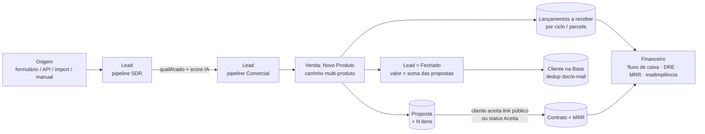

## 2. Autenticação e contexto de tenant

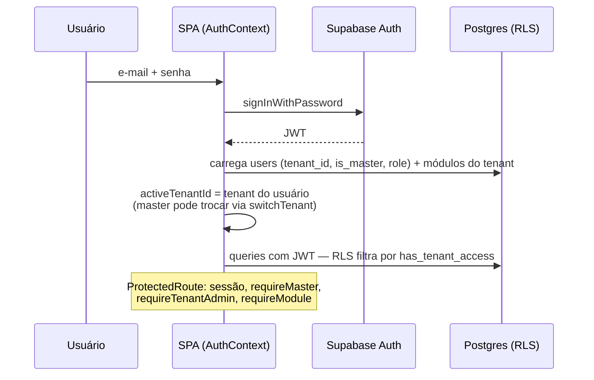

Recuperação de senha: `/redefinir-senha`. Não há auto-registro público (`/register` → `/login`). Detalhes de login, recuperação e expiração de sessão na §12; provisionamento de tenant, módulos e troca de tenant na §11.

## 3. Funil comercial

1. **Entrada do lead** — `POST /api/v1/leads` (chave de API → tenant; faz *upsert* por telefone/e-mail, ver §25), formulário público `/f/:niche` (`POST /api/public/lead-capture`, ver §24), importação CSV (§13), cadastro manual (`NewLeadModal`). O rodízio de closer para lead sem `seller` é feito pelo trigger `assign_lead_round_robin` (migration `20260905_lead_round_robin_closers.sql`); a RPC `claim_next_form_sdr` pertence ao formulário E-EMPREENDA+ (§18.5), não ao `/f/:niche`.
2. **Pipeline SDR** — etapas configuráveis em `crm_funis`/`crm_pipeline_stages`; score IA recalculado (`/api/leads/calculate-score`) quando status/etapa muda (400 ms depois, com o lead já mesclado para não reverter a coluna).
3. **Handoff SDR → Comercial** — ao mover `pipelineId: 'sdr' → 'comercial'`, o sistema notifica e registra a temperatura.
4. **Comercial** — reuniões, follow-ups, atividades, propostas.
5. **Fechamento** — ver §4. Status vira **Fechado**, `scoreIA = 100`, temperatura "quente".

## 4. Fluxo de venda multi-produto (Novo Produto no lead)

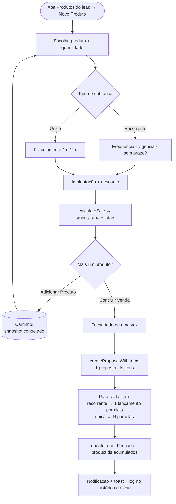

Regras: forma de pagamento, parcelas e 1º vencimento são **compartilhados** pela venda; cada produto tem seu próprio grupo de cobrança (`recurring_group_id` / `installment_group_id`); o produto ainda no formulário entra automaticamente ao concluir (vender 1 produto não exige clicar "Adicionar").

## 5. Ciclo de vida da proposta

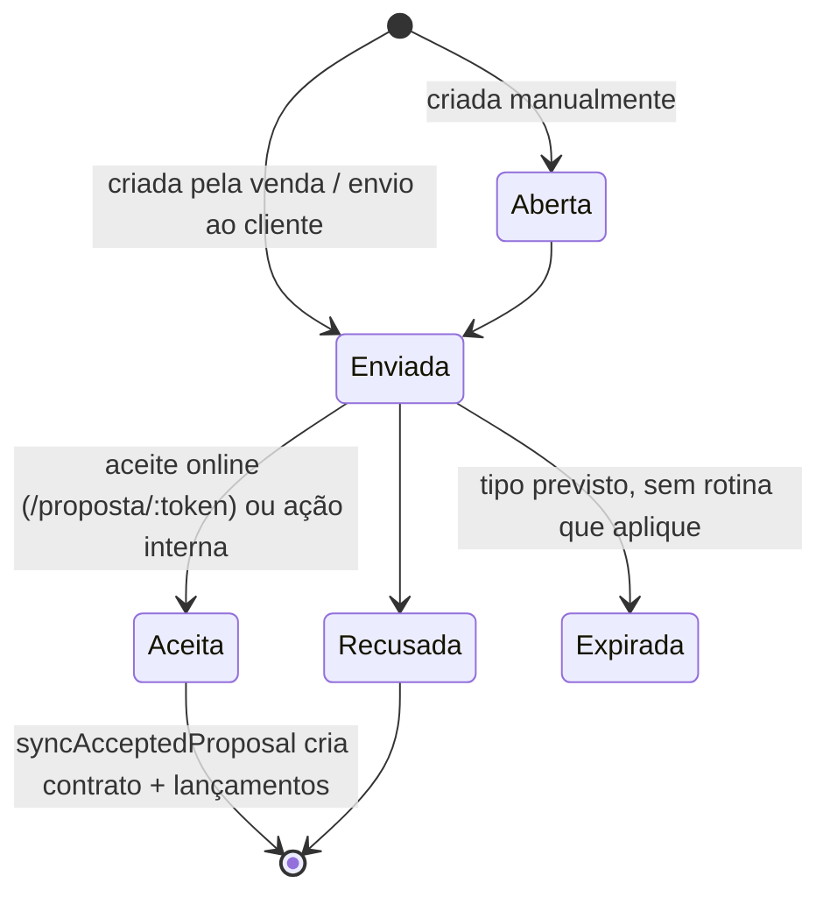

- **Link público:** cada proposta tem `view_token`; a página `/proposta/:token` registra visualizações (`view_count`) e permite aceite sem login (detalhes e limitações na §24.1). O status "Expirada" existe só no tipo TypeScript (`src/pages/crm/utils/proposalPdf.ts`): não encontrei rotina que o aplique — a página pública apenas desabilita o botão de aceite quando `validade` já passou.
- **Editor de contrato:** cliente, título, consultor, vigência, decisor (copiado do lead na criação), tabela de itens (recorrente = 1× valor do ciclo), cláusulas (inserção com 1 clique), total editável, PDF.
- **Aceite → `syncAcceptedProposal`:** cria contrato (`mrr` = total recorrente ÷ meses do contrato, com desconto proporcional), lançamento "Contrato/Recorrente" e, se houver, "Implantação/Setup"; ajusta `leads.value`; **não roda duas vezes** para a mesma proposta.
- **Exclusão:** remove itens (cascade), lançamentos ligados por `proposal_id`, contrato auto-gerado e recalcula o valor do lead.

## 6. Lead ganho → Cliente

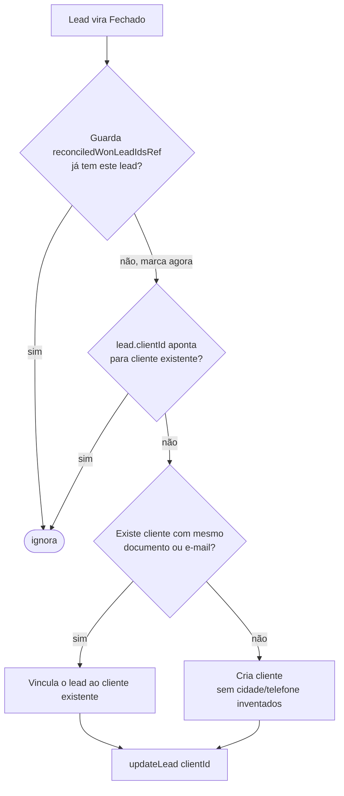

A guarda é marcada **nos dois disparadores** (transição ao vivo e reconciliação em lote) — foi a causa raiz de clientes duplicados criados com ~200 ms de diferença. Excluir cliente limpa `clientId` dos leads (evita vínculo órfão).

## 7. Financeiro

- **Entradas:** vendas (por ciclo/parcela), contratos, lançamentos manuais, API `POST /api/v1/finance-entries` (upsert por `externalId`), importação de extrato.
- **Status:** A Vencer → Pago (1ª cobrança nasce "Pago" se forma = Pix/Dinheiro/Débito).
- **Controles:** categorias/plano de contas, centros de custo, contas bancárias, transferências, orçamentos, bloqueio de período, auditoria de alterações, comissões por meta de squad.
- **Saídas analíticas:** fluxo de caixa, DRE, MRR, projeção, inadimplência, relatórios agrupados.

## 8. Catálogo de produtos (edição e fidelidade)

`Produtos → lápis (editar)` → abas **Info · Comercial · Estoque · Arquivos**. Na aba Comercial: recorrência (duração + ciclo), implantação, **fidelidade** (prazo mínimo + multa %, habilitada só com recorrência) e preço/custo/comissão com margem e LTV. Salvo em `type_attributes` (JSONB) e "desachatado" por `mapProductRow`.

## 9. Administração da plataforma

`Master → /app/admin`: cria tenant + admin inicial (`POST /api/admin/tenant`), liga/desliga módulos e planos, troca credenciais de usuários. `Parceiro → /app/parceiros`: visão dos tenants mapeados. `Admin do tenant → Configurações`: equipe, cargos, permissões, funis, origens, campos, SLA, gatilhos de IA, rodízio, integrações, backups.

## 10. Integrações

| Integração | Direção | Como |
|---|---|---|
| n8n "Julia" | externo → banco | rodízio de leads via `service_role` |
| n8n Aurora | app → n8n | `POST /api/ai/aurora-chat` (URL só no servidor) |
| Formulário E-EMPREENDA+ | público → banco | RPC `claim_next_form_sdr` (anon, tenant fixo) |
| Google Calendar | app ↔ Google | `google_calendar_connections` (OAuth no servidor) + token de navegador em `AgendaCRM`/`AgendaConfiguracoes` — ver §15.2 |
| WhatsApp | provider `simulator` por padrão; `waha` só se `WAHA_API_URL` estiver definida (código **não testado** contra um WAHA real) | ver §17 |
| Gemini / Groq | app → IA | rotas `/api/ai/*` (e, hoje, alguns pontos no cliente) |

---

## 11. Tenants, módulos, planos, onboarding e troca de tenant

### 11.1 Criação de tenant pelo master

- **Gatilho/ator:** usuário `is_master` em `/app/admin?tab=tenants` → "Novo Tenant" (`src/pages/admin/AdminSaaS.tsx`, `src/pages/admin/components/NovoTenantModal.tsx`). A rota é `requireMaster`.
- **Passos:**
  1. O modal pede nome, nicho (lista fixa `NICHES`), plano, cor primária, módulos e e-mail/senha do administrador. Escolher o nicho pré-marca os módulos (`DEFAULT_MODULES_BY_NICHE`), editáveis um a um.
  2. Plano: `fetchSpyLicenseProducts()` (`src/lib/supabase.ts`) lê `products` **do tenant Pluppex** (`PLUPPEX_TENANT_ID`), ativos e com nome contendo "S.P.Y"; o "tier" é o texto depois do último `|`, em minúsculas. Sem produtos no catálogo, o campo vira texto livre.
  3. Validação no cliente: campos obrigatórios, senha ≥ 6 caracteres e confirmação idêntica (há gerador de senha).
  4. `createTenantAdmin()` chama `POST /api/admin/tenant` (Bearer, timeout 15 s).
  5. No servidor (`server.ts`): `requireUser` + `requireMaster` (lê `users.is_master`). Valida nome, e-mail e senha ≥ 6; devolve **409** se o e-mail já existe em `users`.
  6. Insere em `tenants` (`plan` default `start`, `status` `Active`, `timezone` default `America/Sao_Paulo`, `primary_color` só se for `#RRGGBB`, senão `#2563EB`, `modules` enviados ou um default com CRM/financeiro/produtividade), cria o usuário no Supabase Auth via Admin API (`email_confirm: true`, sem e-mail de confirmação) e insere o perfil em `users` (`role` "Admin", `is_master` false, `active` true, nome `Admin <empresa>`).
- **Tabelas/rotas:** `tenants`, `auth.users`, `users`; `POST /api/admin/tenant`.
- **Erros/bordas:**
  - Falha ao criar o usuário Auth → o tenant recém-criado é apagado. Falha ao criar o perfil → apaga tenant **e** usuário Auth (rollback manual, não transacional).
  - O insert em `users` **não define `is_tenant_admin`**; o valor fica com o default da coluna (não verifiquei o default). Como `requireTenantAdmin` exige `isMaster || isTenantAdmin`, confira se o admin inicial consegue abrir Equipe/Permissões/Cargos.
  - **Falha silenciosa no front:** em `NovoTenantModal.handleSubmit`, se `createTenantAdmin` devolver `success: false` (ou lançar), o código mostra `toast.info('Tenant "X" registrado no ambiente.')`, chama `onCreated()` e fecha o modal. O usuário não vê o erro real.

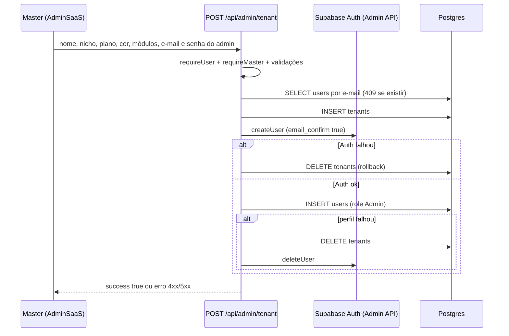

### 11.2 Edição, credenciais e desativação

`src/pages/admin/components/AdminTenantsTab.tsx`:

- **Editar:** `updateTenantInfo` grava `tenants.name` e `tenants.niche` direto pelo cliente Supabase (RLS). Para trocar e-mail/senha do admin: `GET /api/admin/tenant-admin-user/:tenantId` (pega o usuário **não master mais antigo** do tenant) e `POST /api/admin/tenant-user/:userId/credentials` (senha ≥ 6; `auth.admin.updateUserById` e, se houver e-mail novo, `users.email`). Se o nome/nicho salvou mas as credenciais falharam, aparece só um `toast.warning`.
- **Desativar:** `deactivateTenant` faz `tenants.status = 'Inactive'`. O tenant Pluppex é bloqueado no cliente. `fetchTenants()` e `/api/auth/tenant-theme` só consideram tenants `Active`. **Não encontrei bloqueio de login por status:** `fetchUserProfile` não lê `tenants.status` e `has_tenant_access` (migrations `20260803_partners_phase4.sql`, `20260920_optimize_has_tenant_access.sql`) não o referencia. O texto do diálogo ("acessos suspensos imediatamente") merece verificação no banco.
- **"Simular acesso"** (`handleSimulateAccess`): chama `login({...user, tenantName, tenantId})`, isto é, só sobrescreve o objeto de sessão local. **Não é** o `switchTenant` da §11.4 e é volátil (o próximo `applySession` recarrega o perfil real).

### 11.3 Módulos e planos

- **Fonte da verdade:** `tenants.modules` (JSONB). O `AuthContext` carrega `fetchTenants()` (só `Active`) em `allTenantModules`, **indexado pelo nome do tenant**.
- **`isModuleEnabled(mod)`:** usa `getTenantModules(activeTenantName || user.tenantName)` com comparação exata, sem diferenciar maiúsculas. Se o nome não existir no mapa, cai em `{ crm: true, sdr: false, advDashboard: false }`. O master **também** respeita os módulos do tenant ativo.
- **Menu:** `src/components/layout/Sidebar.tsx` (`checkModule`) trata `automotivo` e `concessionaria` como sinônimos, e aceita `agenda`/`documentos` se o módulo `crm` estiver ligado. Além disso, o cargo do usuário (`cargos.modulos`, se não vazio) restringe o menu.
- **Guarda de rota:** só existem `requireModule` em `/app/clinica(s)/prontuarios` (`clinica`) e `/app/educacao/mensalidades` (`educacao`). As demais rotas verticais só somem do menu — digitar a URL abre a tela (a proteção de dados é a RLS; para clínica/educação há reforço de leitura nas migrations `20260919_*` e `20260921_cr3_*`).
- **Edição (master):** `src/pages/admin/components/AdminModulesTab.tsx` → `updateTenantModules(nome, modules)` → estado local + `updateTenantModulesInDB`, que faz `tenants.update({ modules }).eq('name', nome)` — **por nome**, não por id. Há 8 presets (Ecossistema Global, Agência SDR & Closers, Escola, Clínica, Imobiliária, Concessionária, Varejo, Energia Solar). Se o tenant editado é o do usuário, também atualiza `sidebarModules`.
- **Chaves de módulo** listadas em `MODULE_DEFINITIONS`: `crm`, `aurora`, `produtividade`, `financeiro`, `catalogo`, `marketing`, `engajamento`, `educacao`, `clinica`, `rh`, `bi`, `imobiliaria`, `concessionaria`, `solar`, `varejo`, `dev`. O `Sidebar` ainda consulta `sdr`, `advDashboard`, `agenda`, `documentos`.
- **Plano:** `tenants.plan` (default `start`). `updateTenantPlan()` (`start | autopilot | autonomous`) existe em `src/lib/supabase.ts`, mas **não achei chamada na UI**. O plano é lido por `useToolRegistry` (`min_plan_tier`) para marcar ferramentas "inclusas" na aba Ferramentas.
- **Aba "Faturamento & Planos"** (`AdminBillingTab.tsx`): as "assinaturas" são **derivadas** (plano fixo "Enterprise" para a Pluppex e "Professional" para os demais, valor = média dos recebimentos pagos do tenant ou 997, status "Pago", ciclo "Mensal"). Não é cobrança real.
- **"Simular perfil"** (`handleSwitchRole` em `AdminModulesTab`): `login({...user, role})`, só local.

### 11.4 Onboarding e primeiro acesso

- **`OnboardingWizard`** (`src/components/OnboardingWizard.tsx`, montado em `Layout.tsx`) está **desativado**: `const DISABLED = true`, com comentário de que os presets cobrem só 4 nichos. Quando reativado: aparece para não-master enquanto `app_settings.onboarding_completed` for falso; passo 1 escolhe um `DEMO_PRESETS`, passo 2 confirma; "Aplicar" executa `updateTenantModulesInDB` + `addFunil` (funil comercial em `crm_funis`) + `saveAppSetting('onboarding_completed', true)`. Fechar ou "Pular" também grava `onboarding_completed`.
- **Primeiro acesso hoje:** o master informa e-mail/senha ao admin → `/login` → `/app/dashboard`. Não há e-mail de convite. A troca de senha usa a §12.
- **Tema da tela de login:** `GET /api/auth/tenant-theme?email=` (público) devolve cor e nome do tenant: primeiro casa o e-mail exato em `users`; senão procura tokens do e-mail/domínio no nome de tenants `Active`. Efeito colateral: o endpoint revela nome/cor do tenant de e-mails existentes.

### 11.5 Troca de tenant e de filial

- **`switchTenant(id, name)`** (`AuthContext.tsx`): só age se `user.isMaster` **ou** `user.partnerId`. A UI é o `<select>` do `Sidebar` (só aparece com mais de uma opção em `tenantIdMap`, que vem de `fetchTenantIdMap()` já filtrado pela RLS). O estado `tenantOverride` é só de memória: não persiste em reload e é zerado quando `user.id` muda. Escolher o tenant do próprio usuário remove o override.
- **Efeitos da troca:** `activeTenantId` muda → `DataContext` zera dezenas de estados de negócio e recarrega tudo (§23); a cor do tenant é reaplicada; chamadas do Google Calendar enviam o header `x-active-tenant-id`; rotas de resumo enviam `?tenantId=` e o servidor valida em `resolveRequestedTenantId` (usa o tenant do chamador se ausente/igual; senão RPC `has_tenant_access`, com **403** "Sem acesso a este tenant.").
- **`switchFilial`:** master ou `isTenantAdmin`, quando há filiais em `empresa_filiais`. `filterByFilial` (DataContext) mostra linhas da filial ativa **e as sem `filial_id`**; registros novos são carimbados com `filial_id` (leads criados por `addLead`, entradas financeiras, contratos, tarefas, agendamentos).

## 12. Login, recuperação de senha e sessão

### 12.1 Login

`src/pages/auth/Login.tsx` + `components/LoginForm.tsx`:

1. E-mail e senha obrigatórios; `signIn()` chama `supabase.auth.signInWithPassword`. "Invalid login credentials" vira "E-mail ou senha inválidos."
2. Com o Auth ok, `fetchUserProfile(id)` lê `users` (`.eq('active', true)`) com o join `tenants(id, name, niche, primary_color)`. Sem perfil ativo, ou sem tenant vinculado, faz `signOut()` e devolve erro ("Perfil de usuário não encontrado ou inativo." / "não possui uma empresa").
3. `login(user)` grava o perfil em `sessionStorage['spy_user_session']` (cache de conveniência) e o app segue para `location.state.from` ou `/app/dashboard`. A cor do tenant é persistida para favicon/tela de login.
4. Não há botão de "acesso demonstração" no login atual. O `AuthContext` mantém um fallback de sessão demo em `sessionStorage`, mas `applySession` **ignora esse cache quando não há JWT** (comentário de segurança no código).

### 12.2 Esqueci a senha

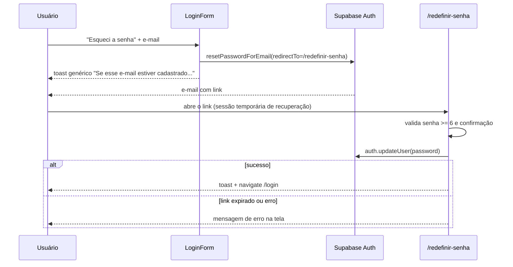

- `requestPasswordReset` (`src/lib/supabase.ts`): a UI **sempre** mostra o mesmo toast, exista o e-mail ou não (anti-enumeração), inclusive se o envio falhar.
- `src/pages/auth/ResetPassword.tsx`: valida `password.length >= 6` e igualdade; `updatePassword` falha com a mensagem do Supabase (ou "O link pode ter expirado — solicite um novo"). A página **não checa** se existe sessão de recuperação antes de enviar. Como `onAuthStateChange` não distingue o evento, o link de recuperação já abre uma sessão completa (perfil carregado); não verifiquei se a sessão é encerrada depois de trocar a senha.
- **Redefinição pelo master:** `POST /api/admin/tenant-user/:userId/credentials` (§11.2). **Convite de colaborador:** `createUserWithProfile` faz `signUp` em um client Supabase isolado (não troca a sessão do admin); pode retornar `needsEmailConfirmation`.
- **Sem auto-registro:** `/register` redireciona para `/login`.

### 12.3 Sessão e expiração

- O client (`createClient(url, anonKey)`, sem opções) usa os padrões do supabase-js (persistência e renovação automática do token). `AuthProvider` mantém `authLoading = true` até `getSession()` + perfil, para `ProtectedRoute` não redirecionar em falso durante o refresh de página.
- `onAuthStateChange` → `applySession(userId)`: sem sessão → `user = null` → `ProtectedRoute` manda para `/login` com `state.from`. Perfil inativo (`users.active = false`) também resulta em `user = null`, mesmo com JWT válido.
- `apiFetch` (`src/lib/apiClient.ts`) só anexa o `Bearer` da sessão atual; **não trata 401** (cada tela decide o que fazer). No servidor, `requireUser` responde 401 "Autenticação obrigatória." ou "Sessão inválida ou expirada.".
- `logout()` limpa o `sessionStorage`, zera `user` e chama `signOut`. Não há logout por inatividade no código.
- **Guardas do `ProtectedRoute`:** sessão; `requireMaster`; `requirePartner` (`isMaster` ou `partnerId`); `requireTenantAdmin` (`isMaster` ou `isTenantAdmin`); `requireModule` (§11.3). Todas redirecionam para `/app` (exceto a falta de sessão, que vai para `/login`).

## 13. Importação de leads por CSV

- **Tela:** `/app/crm/importacao` (`src/pages/crm/Importacao.tsx`). **Ator:** usuário do CRM com o tenant ativo.
- **Passos:**
  1. **Upload** (`.csv`/`.txt`, sem limite de tamanho no código). Parser `papaparse` (`header: true`, `skipEmptyLines`). Sem colunas ou sem linhas → toast de erro.
  2. **Mapeamento:** `guessTargetField` sugere por substring do cabeçalho (nome/name, empresa/company, email/e-mail, tel/phone/whats, valor/value, origem/source, interesse); o usuário ajusta cada coluna. É obrigatório mapear **Nome**.
  3. **Revisão:** `buildMappedRows` descarta linhas sem nome, e-mail **e** telefone; o valor passa por `parseMoney`. Duplicados: consulta `leads` do tenant com `.or(email.in.(...), phone.in.(...))` e compara **valores exatos** (telefone não é normalizado; a API `/api/v1/leads` normaliza para dígitos). O checkbox "Pular duplicados" (padrão marcado) só aparece se houver duplicados.
  4. **Importação:** `INSERT` direto em `leads` pelo cliente Supabase, em lotes de 25. Cada linha recebe `status: "Novo"`, `stageId: "sdr-1"`, `pipelineId: "sdr"`, `seller: user.name`, `scoreIA: 50`, `source: "Importação CSV"` (se vazio), `name: "Lead Importado"` (se vazio), `customFields: {}`, `tenant_id`.
  5. **Resultado:** inseridos, pulados por duplicidade, falhas (com a mensagem por lote). Lote que falha não impede os outros.
- **Não acontece:** duplicata **dentro** do próprio arquivo não é detectada (só contra o banco); `filial_id` não é preenchido; o score IA não é recalculado (fica 50 até uma mudança de status/etapa); o rodízio de closer não atua porque `seller` já vem preenchido. `refetchLeads` é lido de `useData()` com cast `any`, mas **não existe** no `DataContext` — a chamada é um no-op; os leads aparecem pelo Realtime (§23), que dispara **um `toast.info("Novo lead: ...")` por INSERT**.
- **Modelo:** "Baixar Planilha Modelo" gera `modelo_importacao_leads_spy.csv` (Nome, Empresa, Email, Telefone, Valor).

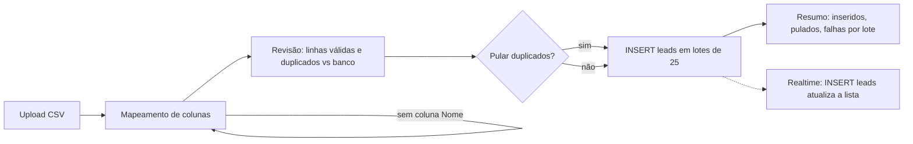

## 14. Importação de extrato financeiro e conciliação

### 14.1 Importar movimentações (`/app/financeiro/importar`)

`src/pages/finance/FinanceiroImportarMovimentacoes.tsx`:

- **Arquivo:** apenas `.csv`/`.txt`, até **2 MB**. Parser próprio (aceita `,` ou `;` e aspas; **não** suporta quebra de linha dentro de campo). Colunas obrigatórias: Tipo de Lançamento, Data Pagamento, Descrição, Valor, Conta, Pago. Opcionais: Data Competência, Categoria, Recebido de / Pago a, Detalhes, Número do Documento, Forma de Pagamento, Centro de Custo, Tags. "Baixar modelo" gera o CSV de exemplo.
- **Validação por linha** (linhas com erro aparecem na prévia e são ignoradas): tipo ∈ {Recebimentos, Despesas fixas, Despesas variáveis, Pessoas, Impostos}; descrição preenchida (corta em 255); valor > 0; conta preenchida; data `dd/mm/aaaa`. "Pago" só é verdadeiro para `sim`.
- **Formato numérico:** `parseValorBR` remove **todos** os pontos e troca a vírgula por ponto — vale para pt-BR (`1.450,35`), mas `1450.35` vira `145035`. Valor negativo é convertido em positivo.
- **Importação** (uma linha por vez, sequencial): busca-ou-cria a **conta bancária** (`CONTA_CORRENTE`, saldo inicial 0), a **categoria** (tipo Receita/Despesa + nome; sem categoria usa "Importado" ou "Importado (SUBTIPO)") e o **centro de custo**; depois chama `addFinanceEntry(..., { silent: true })` com `status` `Pago`/`A Vencer`, `competencia_date`, `tags`, `numero_documento`, `payment_method`.
- **Bordas:** não há deduplicação (importar o mesmo arquivo duas vezes duplica os lançamentos). `addFinanceEntry` **não lança exceção** — período bloqueado (§21.4) ou erro do banco só geram toast e `return` — então o contador "ok" da tela pode **superestimar** os sucessos. Cada lançamento criado grava `finance_audit_log` (`CRIACAO`).

### 14.2 Conciliação bancária (`/app/financeiro/conciliacao`)

`src/pages/finance/FinanceiroConciliacao.tsx`, tabela `finance_extratos_importados`.

1. **Upload** `.ofx/.qfx/.csv/.txt`. OFX: regex sobre cada `<STMTTRN>` (`TRNAMT`, `DTPOSTED`, `NAME`/`MEMO`, `TRNTYPE`, `FITID`). CSV: colunas `data,descricao,valor[,tipo]` separadas por `,` ou `;`, sem cabeçalho (linha com valor não numérico é ignorada). O banco é sempre o rótulo fixo "Conta Importada" — não se liga a uma conta de `finance_bank_accounts`.
2. Os itens são gravados em `finance_extratos_importados` (`tenant_id`, `data`, `descricao`, `documento`, `valor`, `tipo`, `banco`, `conciliado`). Não há deduplicação por `FITID`.
3. **"Conciliar Automaticamente (IA)":** **não usa IA.** Para cada item pendente procura, em `financeEntries` já carregado, o primeiro lançamento com `|valor − item| < 0,01` e tipo compatível (crédito → `Receber`, débito → `Pagar`) ainda não usado naquela execução. Ignora data, descrição e status. Marca `conciliado = true` e `match_sugerido = descrição do lançamento` no extrato. Falha de gravação só vai para `console.error` (a tela já mostra conciliado).
4. **"Aprovar Match"** (manual) apenas seta `conciliado = true` no item — sem escolher/vincular lançamento.
- **O que não acontece:** o lançamento financeiro **não é alterado** (status continua como estava, não vira "Pago"); item sem correspondência não gera lançamento; não existe "desfazer conciliação".

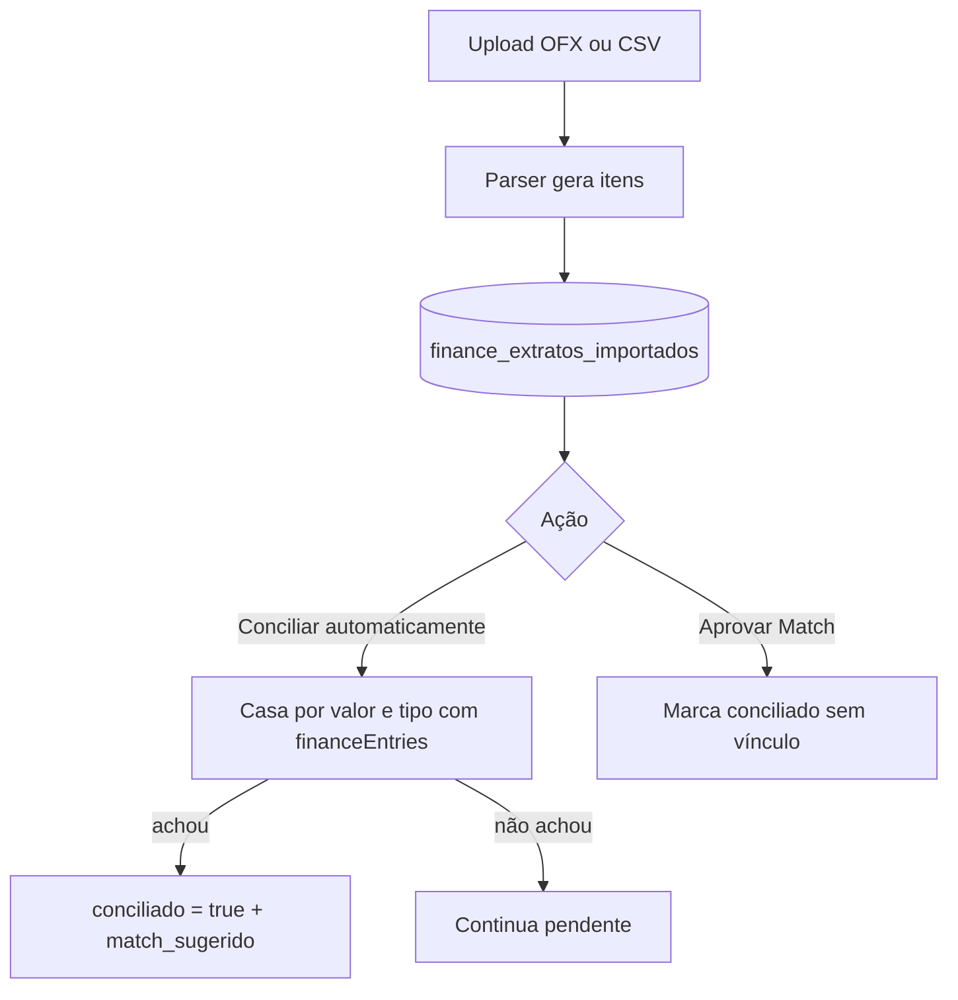

## 15. Agenda, reuniões e Google Calendar

### 15.1 Telas

| Rota | Tela | Observação |
|---|---|---|
| `/app/agenda/calendario`, `/app/crm/agenda` | `src/pages/crm/AgendaCRM.tsx` (`Calendario.tsx` só reexporta) | calendário + lista de `reunioes` |
| `/app/agenda/reunioes`, `/app/reunioes` | `src/pages/reunioes/index.tsx` | lista por status, cópia de link, exclusão |
| `/app/agenda/reunioes/:id`, `/app/reunioes/:id` | `src/pages/reunioes/ReuniaoRoom.tsx` | sala com vídeo, notas, Aurora, relatório |
| `/app/agenda/eventos` | `src/pages/agenda/Eventos.tsx` | **provável quebra:** lê `titulo`, `data_agendada`, `closer_nome`, que não existem no tipo `Reuniao` (`leadName`, `scheduledAt`, `closerName`); `e.titulo.toLowerCase()` falha com qualquer reunião existente (leitura de código, não executado) |
| `/app/agenda/disponibilidade` | `Disponibilidade.tsx` | grava `app_settings['agenda_disponibilidade']`; **nenhum agendamento consome essa grade** |
| `/app/agenda/configuracoes` | `AgendaConfiguracoes.tsx` | `app_settings['agenda_configuracoes']` + conectar/desconectar Google |

### 15.2 Agendar reunião (a partir de um lead)

- **Gatilho:** botão de reunião no lead do Pipeline → `AgendarReuniaoModal` (`src/components/ui/modals/crm/AgendarReuniaoModal.tsx`).
- **Passos:**
  1. Escolhe closer (colaboradores ativos, ou vendedores dos leads, ou o próprio usuário), data, hora, duração (padrão 60), pauta e convidados.
  2. Formato: `axis` (sala S.P.Y. — link Jitsi via `generateJitsiLink(reuniaoId)`), `google` (Google Meet via `POST /api/google-calendar/meet-space` + evento) ou `presencial` (endereço **obrigatório**). Sem Google conectado, aceita um link manual.
  3. Se há conexão Google, cria evento em `POST /api/google-calendar/events` (convida lead, closer e participantes; `skipConferenceData` para Jitsi/presencial; fuso fixo `America/Sao_Paulo`). Falha no convite gera `toast.warning`, mas **a reunião é criada mesmo assim**.
  4. `addReuniao` → `INSERT` em `reunioes` (`status: 'Agendada'`, `meetLink`, `googleEventId`, `pauta`, `createdAt`...).
  5. Mensagem pronta para o lead abre `https://wa.me/...` (o usuário envia pelo próprio WhatsApp; **não é envio do sistema**).
  6. `Pipeline.handleReuniaoConfirm`: **promove o lead** para `pipelineId: "comercial"` na etapa `app_settings['axis_reuniao_config'].promotionStageId` (padrão `"1"`) e navega para `/app/reunioes/:id`.
- **Erros:** closer/data/hora ausentes; presencial sem endereço; Google desconectado ou com token expirado ("reconecte e tente novamente").

### 15.3 Sala da reunião (`ReuniaoRoom`)

- Vídeo: `JitsiEmbed` quando `meetLink` é Jitsi (**sair da sala, `onLeave`, chama `handleEnd`**, isto é, encerra a reunião e gera o relatório); para outros links a tela usa o link externo. `AuroraJitsiVoice` entra na sala como "Aurora — IA".
- **Transcrição:** `useAuroraMeetingPresence` usa `SpeechRecognition`/`webkitSpeechRecognition` do navegador (sem suporte → erro amigável). A cada ciclo manda o trecho novo para `POST /api/ai/aurora-chat` com `sessionId = aurora-reuniao-<id>`; o servidor valida (via `req.supabase`, RLS) que a reunião existe para o tenant do chamador (senão 403). Por padrão a Aurora fica em silêncio e só fala quando a resposta começa com o prefixo de fala.
- **Encerrar** (`handleEnd`): `POST /api/ai/reuniao-relatorio` (Gemini/Groq) gera o relatório em markdown (resumo, BANT final, objeções, próximos passos, probabilidade de fechamento) e o servidor grava `relatorio_ia`, `transcricao`, `notas_closer` e `status: 'Concluída'` em `reunioes`. Sem chave de IA, devolve texto "Relatório não disponível". Se a chamada falhar, o front ainda marca `Concluída` (sem relatório).
- **"Analisar com a Aurora":** manda transcrição + contexto do lead para `/api/ai/aurora-chat` (webhook n8n); a saída pode ser salva como atividade do lead (`addLeadActivity('Reunião', 'Análise da Aurora', ...)`).
- **Status de reunião:** `Agendada → Concluída | Cancelada`. **"Em Andamento" existe nos filtros e KPIs, mas nada no código o atribui.**

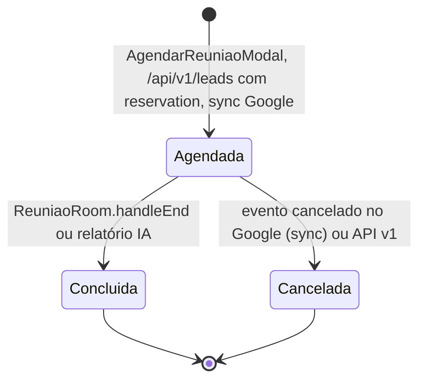

### 15.4 Google Calendar: dois mecanismos independentes

1. **OAuth no servidor** (`server/googleCalendar.ts`, cliente em `src/lib/google-auth.ts`, `google-calendar.ts`, `meet.ts`): usado por `AgendarReuniaoModal`, `Telemedicina`, `AgendaMedica`.
   - Rotas (`/api/google-calendar/*`, limite 60/min): `GET /connect/start` (gera URL de consentimento com `state` assinado por HMAC, validade 10 min, `returnTo` sanitizado); `GET /oauth/callback` (troca o código, lê o e-mail e faz *upsert* em `google_calendar_connections` por `tenant_id + user_id`); `GET /status`; `POST /disconnect` (revoga o token e zera tokens); `GET /events`; `POST /events`; `POST /meet-space`; `POST /sync`.
   - Escopos: `calendar.events`, `calendar.readonly`, `meetings.space.created`, `email`, `profile`.
   - Renovação automática do `access_token` (margem de 2 min). Falha na renovação ou ausência de `refresh_token` → `status = requires_reauth` e as rotas respondem **409** `google_calendar_reauth_required`; sem conexão → **404** `google_calendar_not_connected`. Na 1ª conexão sem `refresh_token` o callback volta com `reason=missing_refresh_token`.
   - `POST /sync`: **unidirecional Google → `reunioes`**, idempotente por `googleEventId` (id `gcal-<eventId>`), janela padrão −30/+90 dias, máx. 250 eventos; eventos cancelados só atualizam reuniões já existentes.
   - Eventos ficam auditados (`google_calendar.connected`, `sync_completed`, `token_refresh_failed`, ...).
2. **Token de navegador** (`src/lib/firebase.ts`: `googleSignIn`/`getAccessToken`/`initAuth`): usado por `AgendaCRM`, `AgendaConfiguracoes` e por Tarefas (Google Tasks). O token vive só na aba (sem `refresh_token`) e o navegador chama `https://www.googleapis.com/calendar/v3/...` direto. `AgendaCRM.handleSyncGoogle` só importa eventos que parecem reunião (`isRealMeeting`: link de vídeo, outros convidados ou palavra-chave; exclui palavras "pessoais"); deduplica por `googleEventId` e faz `addReuniao`/`updateReuniao`.
- **Atenção:** as duas conexões são independentes (conectar em uma não conecta na outra). **Desconectar no `AgendaCRM`/`AgendaConfiguracoes` apaga (`deleteReuniao`) todas as reuniões com `googleEventId`** — inclusive as que o próprio CRM criou com Google Meet pelo `AgendarReuniaoModal`.

## 16. Follow-ups, tarefas e atividades

### 16.1 Follow-ups (`/app/crm/follow-ups`)

`src/pages/crm/FollowUps.tsx` é uma **visão derivada**, sem tabela própria: lista os leads que não estão `Fechado`/`Perdido`, calcula `daysInactive` a partir de `updated_at || created_at` e marca `isUrgent` se `≥ 3` dias ou temperatura "quente". Ordena por inatividade; tem busca, paginação e link `wa.me/55<telefone>` (abre o WhatsApp do usuário). Não cria tarefa nem lembrete.

### 16.2 Tarefas (`/app/tarefas`)

`src/pages/operative/Tarefas.tsx`, `tarefas/useTarefas.ts`, tabela `tasks`.

1. **Criar** (`NovaTarefaModal`): título, descrição, vencimento, prioridade, lead relacionado (`lead_id`), responsável (`assigned_to` = `users.id`). `addTask` (DataContext) faz update otimista, cria notificação "Nova Tarefa" e `INSERT` em `tasks` só com as colunas reais (`pickTaskColumns`); **em erro, reverte o estado local** e mostra toast.
2. `pushTaskToGoogle` tenta criar a tarefa também no Google Tasks (token de navegador); `handleSyncGoogleTasks` importa tarefas do Google Tasks como "Em Aberto/Concluída".
3. **Status:** `Em Aberto`, `Atrasado`, `Concluída` (kanban configurável via `useKanbanConfig`), além de `A Fazer`, `Aguardando`, `Cancelado` no tipo. **Não encontrei rotina que troque `Em Aberto → Atrasado` por data**; a troca é manual (arrastar/marcar).
4. **Geradas automaticamente pelo sistema:** "Nutrição de Reengajamento: <lead>" (lead com `scoreIA < 40`, §20.4); tarefas de follow-up nas etapas de fatura solar (§19.4); tarefa "Consulta" ao agendar na clínica (§19.1); tarefas criadas pelo botão do `RevenueIntelligenceModal` (§20.6).
5. `updateTask`/`deleteTask` no `DataContext`; Realtime debounced em `tasks` (§23).

### 16.3 Atividades

- **Registro real:** `addLeadActivity(leadId, tipo, título, descrição, vendedor)` (`Ligação | E-mail | Reunião | Outro`) faz `INSERT` em `lead_activities` (`lead_id`, `tenant_id`) e **dispara `triggerScoreRecalculation`**. Vem do Lead Details, da Mensageria (§17) e da análise da Aurora na reunião. Externamente: `POST /api/v1/lead-activities` (§25).
- **`/app/crm/atividades`** (`Atividades.tsx`) é um feed **sintético**: monta a lista a partir de `lead.notes` (ou uma linha "Lead ingressou no funil via canal X"); **não lê `lead_activities`**. O botão "Nova atividade" só mostra um toast orientando a abrir o lead.

## 17. Mensageria e WhatsApp

### 17.1 O que é real e o que é simulado

| Peça | Estado |
|---|---|
| Provider de WhatsApp | `getActiveProviderName()`: `waha` se `WAHA_API_URL` estiver definida; **senão `simulator`** |
| `SimulatorProvider` | QR "SIMULADOR", conexão instantânea com número aleatório, envio sempre "com sucesso" — **nada sai para o WhatsApp** |
| `WAHAProvider` | implementado (sessions, QR, `sendText`), mas o próprio arquivo diz **"nunca foi exercitado contra um servidor WAHA real"** |
| Aviso na UI | `GET /api/whatsapp/provider-status` (usado em `ConfigIntegracoesApps.tsx` e `WhatsAppTriggersSection.tsx`) informa qual provider está ativo |
| Mensageria `Messaging.tsx` | conversa via `/api/whatsapp/*`; contatos iniciais vêm dos leads como placeholders "Inicie o atendimento" |
| Painel "Master AI" da conversa (`handleAiAsk`) | **simulado:** `setTimeout` de 1,5 s com resposta fixa sobre frete grátis |
| Copilot de conversa (`/api/whatsapp/copilot/analyze`) | real com `GEMINI_API_KEY`; **sem chave devolve resposta fixa** de exemplo |
| Lembrete de teleconsulta (DataContext, a cada 30 s) | **simulado:** `console.log` + `toast` + notificação; não envia mensagem |
| E-mail "de boas-vindas" ao virar cliente | **simulado:** só toast e notificação |
| Régua de cobrança (Mensalidades) | **simulada:** só toast |
| Automações de marketing "Simular disparo" | **simulado** (§18.3) |
| Links `wa.me` (follow-ups, visitas, corretores, reunião) | abrem o WhatsApp do usuário; não passam pelo servidor |

### 17.2 Instâncias e conexão

- **Rotas** (`server.ts`, `requireUser`, limite 60/min): `GET/POST /api/whatsapp/instances`, `POST /instances/:id/qrcode`, `POST /instances/:id/connect`, `PUT /instances/:id`, `DELETE /instances/:id`.
- **Criar instância:** insere em `whatsapp_instances` (`status: DISCONNECTED`, `provider`), monta a URL de webhook `PUBLIC_APP_URL/api/whatsapp/webhook/<id>?secret=<webhook_secret>` e chama `provider.createInstance`. Se o provider falhar, a linha **fica criada** (desconectada) e a rota devolve a instância mesmo assim.
- `qrcode` atualiza `status`/`qrcode`; `connect` consulta o estado no provider e grava `status`/`phone`. `PUT` não permite editar o webhook.

### 17.3 Recebimento e resposta automática

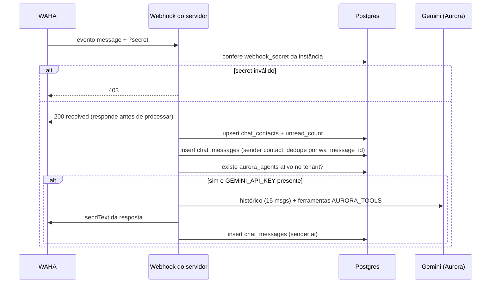

- Ignora `fromMe`, eventos que não são `message` e mensagens sem texto. Reentrega do mesmo `wa_message_id` (erro 23505) não dispara nova resposta.
- **Só responde** se o tenant tiver ao menos um agente ativo em `aurora_agents` e `GEMINI_API_KEY` definida.

### 17.4 Envio, leitura e polling

- `POST /api/whatsapp/messages/send`: com provider `waha` exige telefone e instância conectada (409 se não houver) e faz o envio real; com `simulator` **só grava** `chat_messages` (`sender: human`, `status: sent`) e atualiza `chat_contacts`. Erro do WAHA → 502.
- `GET /api/whatsapp/contacts` (500 mais recentes) e `GET /api/whatsapp/messages/:contactId` (200 mais recentes, em ordem cronológica). A tela consulta **a cada 4 s** (contatos) e **3 s** (mensagens da conversa aberta); som de notificação quando `unread` aumenta; falha marca `isOffline` e oferece "reconectar".
- **Bordas:** o envio otimista na tela **não verifica `res.ok`** (usa `.then(res => res.json())` sem checar); um `contactId` que ainda é placeholder de lead resulta em 404 silencioso. `POST /api/whatsapp/contacts` prefixa `+55 ` em telefone sem `+` e reaproveita contato existente pelo telefone.
- **Chat interno** (`mode: "interno"`, `useInternalChat.ts`): canais em `internal_channels` (o canal "geral" é criado automaticamente), mensagens com Realtime; independente do WhatsApp.
- `AddActivityDialog`: registra atividade manual no lead (`addLeadActivity`) a partir da conversa.

## 18. Marketing

### 18.1 Conteúdo (`/app/marketing/conteudo`)

`MarketingConteudo.tsx` + `useMarketingConteudo.ts`: kanban de pautas em `marketing_content` (criar, arrastar entre colunas, editar, concluir = mover para a última coluna). "Arquivar" faz `deleted_at`; "Excluir" apaga. O botão **Calendário é placeholder** ("em breve"). Roteiros por IA: `TaskDetailsDrawer` → `POST /api/ai/content-script`.

### 18.2 Campanhas e analytics (`/campanhas`, `/analytics`, `/social`)

- **Campanhas** não têm cadastro na UI (não achei `addMarketingCampaign` em nenhuma tela): a página é **analítica**, derivada de `leads` (agrupados por `source`, fechados, conversão), **todos** os lançamentos `Pagar` pagos (tratados como "gasto", sem filtrar por categoria de marketing — o CPA = gasto ÷ leads fica inflado se houver outras despesas) e os `Receber` pagos (receita); usa `GET /api/marketing/campanhas-summary` (cache de 60 s) e cai no cálculo do cliente se falhar. O status de Meta/Google Ads vem de `app_settings`.
- **Analytics:** `GET /api/marketing/analytics-summary` com o mesmo fallback.
- **Social:** o botão de conectar redes mostra "ainda não disponível — em breve".

### 18.3 Automações (`/app/automacoes`)

`MarketingAutomacoes.tsx` (a outra tela, `marketing/Automations.tsx`, é importada em `App.tsx` mas **não tem rota**): CRUD em `marketing_automations` (nome, gatilho de uma lista, canal, passos WhatsApp/e-mail/espera, status Ativa/Pausada). **Não existe motor de execução no repositório** (o servidor só lista a tabela em `/api/data/table-preview`). "Simular disparo" (`handleSimulateExecution`) apenas incrementa `active_count`, altera `conversion_rate` com `Math.random()` e grava `last_run` — **dados fictícios**. `WhatsAppTriggersSection` lista instâncias reais via `/api/whatsapp/instances`, mas não dispara nada.

### 18.4 Landing pages (`/app/marketing/landing-pages`)

`MarketingLandingPages.tsx`, tabela `marketing_landing_pages`. **Não é um construtor de páginas:** cadastra o nome/URL, o Pixel (`meta_pixel_id`) e o GA (`google_analytics_id`), alterna `published`/`draft` e mostra um script para o cliente copiar. **Simulação:** ao criar uma página, o código grava métricas inventadas (`views: 120`, `clicks: 45`, `conversions: 8`, `salesVal: 6800`); ao "conectar LP de cliente", `340/110/14/11900`. Só depois disso os números deveriam vir de rastreamento real, mas não achei o coletor.

### 18.5 Formulários e E-EMPREENDA+

- **Lista** (`MarketingFormularios.tsx`): `marketing_forms`. O formulário "E-EMPREENDA+" é injetado como padrão **apenas para o tenant Pluppex** (`PLUPPEX_TENANT_ID`) e não pode ser excluído.
- **Detalhe** (`FormDetail.tsx`): abas Visualizar, Rodízio, Leads e (só para `source = 'landing_empreenda'`) Editar Perguntas. Preferência de formato em `app_settings['form_format_<id>']`; rodízio em `app_settings['form_rodizio_<id>']` (lista de SDRs ativos entre `colaboradores` com cargo `SDR` e status `Ativo`). Métricas (total, hoje, 7 dias, últimos 10) contam `leads` por `source`. O botão de envio da prévia é **simulação** ("Simulação de envio concluída!") e não cria lead.
- **RPC `claim_next_form_sdr(p_tenant_id)`:** usada pelo site externo do E-EMPREENDA+ (pasta `E-EMPREENDA+/`), escolhe o SDR da vez em `app_settings['form_rodizio_empreenda']`; a migration `20260903_scope_claim_next_form_sdr.sql` restringe a função ao tenant fixo do E-EMPREENDA+ (`RAISE EXCEPTION 'access denied'` para qualquer outro).
- **Editor E-EMPREENDA+** (`/app/marketing/landing-pages/eempreenda`, `EEmpreendaEditor.tsx`): edita seções (hero, pilares, benefícios, depoimentos, FAQ) em `landing_configs` com `upsert` por `tenant_id + site_key + section`. O código **fixa** `TENANT_ID = 27ef95ee-...` (Pluppex), `SITE_KEY = "eempreenda"` e a URL de prévia — não é genérico por tenant.

## 19. Módulos verticais

Todos os módulos abaixo são habilitados por `tenants.modules` (§11.3), leem/gravam direto no Supabase pelo cliente (RLS por tenant) e **não** passam por `DataContext`, salvo onde indicado.

### 19.1 Clínica (`/app/clinica*` e `/app/clinicas*`, módulo `clinica`)

| Tela | Tabela(s) | Fluxo |
|---|---|---|
| Agenda (`AgendaMedica`, `BookingModal`) | `appointments` (via `DataContext`), `tasks` | agendar consulta cria `appointments` (`status: Confirmado`) **e** uma tarefa "Consulta: especialidade - médico"; paciente vem de `pacientes` ou de leads. "Sincronizar Google" importa eventos do Google como agendamentos fixos em "Dr. Roberto Vilela"/sala "Google Calendar" |
| Pacientes | `pacientes` | CRUD; pode abrir agendamento |
| Prontuários (`requireModule="clinica"`) | `prontuarios` | entradas por paciente (queixa, diagnóstico) |
| Planos de tratamento | `clinica_planos_tratamento` | CRUD, status e registro de sessões |
| Profissionais / Serviços | `clinica_profissionais`, `clinica_servicos` | CRUD |
| Exames / Estoque | `exames_pedidos`, `estoque_items` | CRUD; status de estoque calculado (`Normal/Alerta/Crítico`) |
| Telemedicina | Google Meet (servidor) | cria sala em `/api/google-calendar/meet-space`; abre em nova aba |
| Faturamento / Painel / BI | `financeEntries`, `appointments`; `/api/clinica/*-summary` | **só leitura** |

- **Ligação com o financeiro:** **não há geração de lançamento** ao concluir consulta ou plano; `Faturamento` apenas soma `finance_entries` do tipo `Receber` (pago, atrasado). Serviços não alimentam o financeiro.
- **Ligação com o CRM:** apenas o agendamento (tarefa + busca de leads como pacientes).
- **Simulado:** lembrete de teleconsulta 30 min antes (§17.1); botões "Integração com fornecedores" e "Link compartilhado" são toasts.

### 19.2 Imobiliário (`/app/imobiliario*`, módulo `imobiliaria`)

- **Tabelas:** `imobiliario_imoveis`, `imobiliario_proprietarios`, `imobiliario_captacoes` (funil Em Avaliação → Contrato de Posse → Fotos & Vistoria → Ativo no Catálogo | Recusado), `imobiliario_empreendimentos`, `imobiliario_corretores` (com `slug`, `comissao_pct`), `imobiliario_visitas` (Agendada → Confirmada → Realizada | Cancelada), `imobiliario_leads`, `imobiliario_comissoes`.
- **Leads próprios:** o pipeline imobiliário (`LeadsPipelineBoard`) usa `imobiliario_leads`, **independente de `leads` do CRM**; `/app/imobiliario/pipeline` redireciona para `/app/crm/pipeline?nicho=imobiliario`.
- **Proposta:** `LeadsPipelineBoard.handleCreateProposta` chama `createProposalWithItems` (mesmo motor de `proposals` do CRM, status "Enviada"), lê o `view_token` e **copia o link `/proposta/<token>`**. Como o lead imobiliário não é um `lead_id` do CRM, essa proposta não atualiza `leads.value`.
- **Comissões** (`/app/imobiliario/comissoes`, `requireTenantAdmin`): calcula total (`valor_venda × %`, padrão 6%), parte do corretor e da imobiliária, com status `A Receber | Em Tramitação | Liquidada`, gravados em `imobiliario_comissoes`. **Não gera lançamentos em `finance_entries`.**
- **Público:** `/imovel/:id` e `/corretor/:slug` (§24.3).
- Vendas de veículos vivem em `imobiliario_veiculos` (§19.3).

### 19.3 Automotivo / Concessionária (`/app/automotivo*` = `/app/concessionaria*`, módulos `automotivo`/`concessionaria`)

- **Tabelas:** `imobiliario_veiculos` (compartilhada com o imobiliário; campos de consignação `is_consignado`, `consignante_nome`, `comissao_percentual`, `repasse_realizado`), `veiculo_financiamentos` (Em Análise, Aprovado, Recusado, Documentação Pendente; usada também em "Trocas"), `automotivo_avaliacoes` (Em Avaliação → Proposta Feita → Aprovado | Recusado), `imobiliario_visitas` (usada como **Test-drives**).
- **Repasse de consignação:** no painel do veículo (`Veiculos.tsx`), `registrar_repasse_consignacao(p_veiculo_id)` (migration `20260906_veiculos_consignacao.sql`) exige veículo consignado, `status = 'Vendido'` e repasse ainda não feito; insere em `finance_entries` uma despesa `Pagar` **`Pendente`** (categoria "Consignação de Veículos", valor = `valor × (1 − comissão%)`) e marca `repasse_realizado`. **Mover o cartão para "Repassado & Finalizado" em `ConsignacoesVeiculos.tsx` só troca colunas, sem chamar a RPC** (não gera lançamento).
- `VeiculoFinanciamentoModal` monta e envia por `wa.me` um resumo da proposta de financiamento (abre o WhatsApp do usuário).

### 19.4 Energia Solar (`/app/energia-solar*` = `/app/solar*`, módulo `solar`)

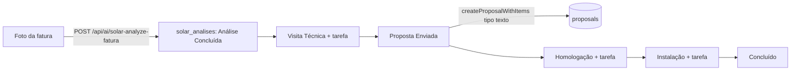

- **Análise de fatura** (`AnaliseFatura.tsx`): upload de imagem (JPEG/PNG/WebP, ≤ ~4 MB) → `analyzeFaturaSolar` → `POST /api/ai/solar-analyze-fatura` (Gemini, chave só no servidor; sem chave, erro 500 "IA Offline") devolve distribuidora, consumo médio, valor, mês, potência estimada (kWp) e economia. Salvar grava `solar_analises`.
- **Avançar estágio** (`STATUS_FLOW`): Análise Concluída → Visita Técnica → Proposta Enviada → Homologação → Instalação → Concluído. Ao entrar em "Proposta Enviada" exige `valor_proposta` (senão bloqueia) e cria a proposta (`createProposalWithItems`, tipo `texto`, vendedor "Energia Solar", **sem `lead_id`**), guardando `proposal_id`. Em "Visita Técnica", "Homologação" e "Instalação" cria uma tarefa de acompanhamento.
- **Demais telas** (CRUD independente, cada uma com seu status): `solar_projetos` (Dimensionamento → Vistoria Concluída → Instalação → Homologação → Conectado à Rede; potência, valor de contrato — se vazios, o cadastro **assume** kWp 5, geração `kWp×125` e valor `kWp×3800`), `solar_vistorias`, `solar_instalacoes` (progresso %), `solar_homologacoes`, `solar_manutencoes`.
- **Ligação com financeiro/CRM:** só a proposta e as tarefas; **não gera lançamento**. Aurora tem a ferramenta `solar_funil_resumo`.

### 19.5 Varejo (`/app/varejo*`, módulo `varejo`)

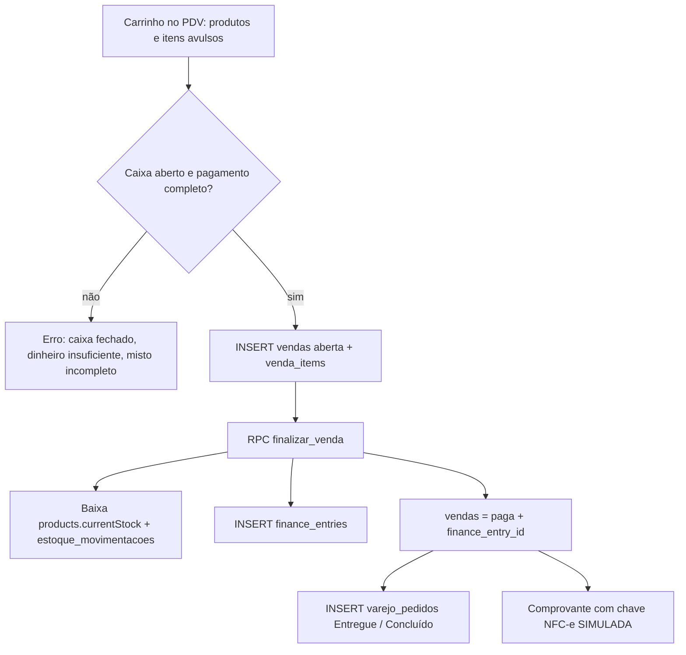

- **PDV** (`Vendas.tsx`): exige caixa aberto (derivado da última operação do dia em `caixa_operacoes`: abertura, sangria, suprimento, fechamento). Formas: Dinheiro (com troco), Pix, Cartão crédito/débito, **Misto** (soma deve fechar), A Prazo (Crediário). Venda "em espera" grava `vendas_em_espera`. Desconto é rateado no preço unitário de cada item.
- **`finalizar_venda(p_venda_id)`** (migrations `20260906_varejo_*`): valida acesso/estado, trava o produto, exige estoque suficiente (senão exceção "Estoque insuficiente"), baixa `products.currentStock`, grava `estoque_movimentacoes` (`tipo 'venda'`), soma o total (item avulso sem estoque), cria o lançamento e marca a venda `paga`. Tudo na mesma transação.
- **Atenção ao vocabulário:** a RPC, como está nas migrations do repositório, grava `finance_entries` com **`type = 'Receita'` e `status = 'Recebido'`**, enquanto as telas/servidor do financeiro filtram `type = 'Receber'` e `status = 'Pago'`. Se o banco ativo estiver igual às migrations, essas vendas **não entram** nos KPIs "recebido" — precisa ser conferido no banco.
- **Simulado:** chave e protocolo da NFC-e são **gerados aleatoriamente** no cliente (`nfce_chave`, `nfce_protocolo`); a confirmação de Pix é manual.
- **Estoque** (`Estoque.tsx`): ajuste chama a RPC `registrar_movimentacao_estoque` (a falha da RPC só gera `console.warn`; a lista local já foi atualizada).
- **Compras** (`ComprasVarejo.tsx`, tabela `compras`, status Pendente → Em Transporte → Recebido no Estoque | Cancelado): "Confirmar recebimento" chama `registrar_movimentacao_estoque` (entrada) e marca a ordem. **Compras não geram conta a pagar.**
- **Pedidos** (`varejo_pedidos`, status Pago/Separando → Em Trânsito/Entrega → Entregue/Concluído | Cancelado) e **Fornecedores** (`varejo_fornecedores`): CRUD; o botão "Pedido" do fornecedor é toast.
- **Catálogo público:** o PDV expõe o link `/catalogo/<tenantId>` (§24.4).

### 19.6 Educação (`/app/educacao*`, módulo `educacao`)

- **Tabelas:** `turmas`, `students`, `mensalidades`, `certificates`, `education_content` (as quatro primeiras via `DataContext`).
- **Matrícula** (`Alunos.tsx` + `NovaMatriculaModal`): `addStudent` cria o aluno; se houver valor de mensalidade, chama a RPC `gerar_mensalidades_matricula(student, turma, valor, dia_vencimento 1–28, parcelas)`, que cria N linhas `Pendente` (uma por mês a partir do mês atual).
  - **Possível bug (leitura de código):** `Alunos.tsx` gera `studentId = Date.now().toString()` e o passa à RPC, mas `addStudent` **sobrescreve o `id`** com `crypto.randomUUID()` (`{ ...student, id: crypto.randomUUID() }`). A RPC receberia um id inexistente e falharia com "Aluno não encontrado" (o front mostra "Matrícula criada, mas falhou ao gerar mensalidades"). Não executei para confirmar.
- **Mensalidades** (`/app/educacao/mensalidades`, `requireModule="educacao"`): filtros, busca, resumo por `GET /api/education/mensalidades-summary`. "Atualizar inadimplência" chama `atualizar_inadimplencia_mensalidades()` (marca `Pendente` vencida como `Atrasado`; **é manual**, não há job). "Marcar Pago" faz `UPDATE` de `status` e `data_pagamento`.
- **Ligação com o financeiro:** **nenhuma** — `mensalidades` é uma tabela própria, sem lançamento em `finance_entries`. O botão de **régua de cobrança é só um toast**.
- **Turmas/Presença:** criar turma funciona; o detalhe da turma mostra "Controle de presença por data ainda não disponível — em breve".
- **Certificados** (`Certificados.tsx`): `addCertificate` (status Emitido/Processando/Revogado, código), PDF via `jsPDF` (`certificatePdf.ts`) e validação de autenticidade por código na própria tela.
- **IA:** `Alunos` → `POST /api/ai/student-performance-insight` (Gemini; sem chave devolve mensagem "IA indisponível").

## 20. Aurora e IA

### 20.1 Mapa das superfícies

| Superfície | Onde | Como funciona |
|---|---|---|
| **Widget da Aurora** | `AuroraWidget.tsx`, exibido em `Layout` se o módulo `aurora` estiver ativo | `POST /api/ai/aurora-chat`: proxy autenticado para o **webhook n8n** (`AURORA_WEBHOOK_URL`, timeout 60 s). Sessão de memória por usuário (`aurora-user-<id>`; master usa `aurora-gustavo-principal`) e envia `tenantId`, `tenantName`, `isMaster`. Sem a variável → 503 |
| **Aurora na reunião** | `ReuniaoRoom`, `useAuroraMeetingPresence`, `AuroraJitsiVoice` | mesmo endpoint, sessão `aurora-reuniao-<id>` validada por RLS (§15.3) |
| **Aurora operacional** | `POST /api/ai/aurora-tenant-chat` | Gemini com *function calling* sobre `req.supabase` (RLS); ferramentas em `AURORA_TOOLS`: `leads_sem_contato`, `resumo_pipeline`, `proximas_reunioes`, `resumo_financeiro`, `tarefas_pendentes`, `vendas_e_propostas`, `clientes_resumo`, `solar_funil_resumo`, `buscar_produto`, `marcar_produto_interesse`. **Não achei chamador no front** (`src`). Respeita agentes desativados citados na mensagem |
| **Auto-reply do WhatsApp** | webhook WAHA (§17.3) | mesmas ferramentas, com `supabaseService` filtrando por `tenant_id` |
| **Copilot do lead** | `LeadCopilot.tsx` (dentro de `LeadDetailsModal`) | `POST /api/ai/lead-copilot` (Gemini/Groq) devolve JSON: resumo, probabilidade de fechamento, próximo passo, abordagem, pergunta de abertura, objeções, alerta. Em erro devolve um JSON de "análise indisponível" |
| **Score do lead** | `POST /api/leads/calculate-score` | ver §20.2 |
| **Auditorias** | `POST /api/ai/performance-audit` (usado por `usePerformanceIA`) | outras rotas de auditoria/consultoria (`pipeline-audit`, `settings-audit`, `marketing-advisor`, `suggest-new-config`) existem no servidor **sem chamador no front** |
| **Outras rotas de IA em uso** | `content-script` (marketing), `suggest-tags` (`NewLeadModal`), `corrigir-nota` (`NotasSection`), `generic-insight` (`getSmartInsight`), `student-performance-insight`, `solar-analyze-fatura` | todas `requireUser` e limitadas a 20/min (`aiLimiter`) |
| **Log e consumo** | `useAuroraAuditLog` (`aurora_audit_log`), `useAuroraTokenUsage` / `AuroraTokenMeter`, `useTenantAiConfig`, `aurora_agents` | leitura escopada por tenant; agentes ativáveis em Configurações → Sistema → Aurora |

### 20.2 Score de lead

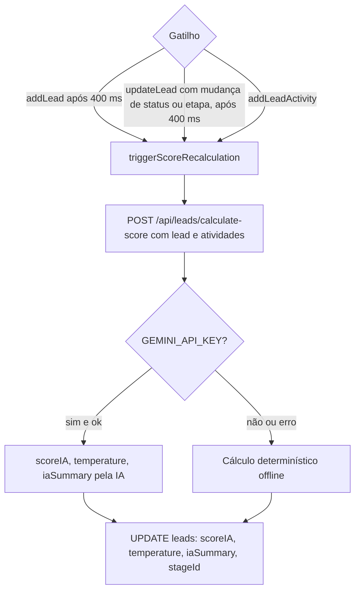

- **Fórmula offline:** base 50; +5 Novo, +10 Prospecção, +20 Qualificado, +30 Em Negociação, +50 Fechado, −30 Perdido; +15/+5/−10 por prioridade Alta/Média/Baixa; +8 por atividade do lead e +15 se houver "Reunião". Limita a 0–100; temperatura: `< 45` frio, `> 75` quente, senão morno. O texto avisa "Cálculo automático (Offline)".
- **Efeito colateral importante:** ao aplicar o resultado, lead do funil `sdr` cuja etapa é vazia, `s1` ou `s2` é movido para `s_qual` (no estado e no banco).
- **Nunca recalcula sozinho por tempo**; o `mergedLead` é repassado para não reverter a coluna do Kanban (bug histórico descrito no código).

### 20.3 Gatilhos de IA (Configurações → CRM → Gatilhos IA)

`SettingsCRMGatilhosIA.tsx` grava regras `{ condition: greater|less, scoreThreshold, targetStageId }` em `app_settings['leadScoreTriggers']`. O motor real é o `useEffect` do `DataContext` (a cada 60 s, 1ª execução após 12 s): para leads do funil **`sdr`** com `scoreIA`, se a regra casa e o lead ainda não está na etapa-alvo, chama `moveLead(id, targetStageId, 0)` e cria notificação. Cada combinação lead+regra+etapa dispara **uma vez por sessão** (`movedByTriggerRef`). Roda **no navegador aberto** — não há execução no servidor.

### 20.4 Reengajamento de lead frio

Também no `DataContext` (1ª execução após 10 s, depois a cada 60 s): lead com `scoreIA < 40` sem tarefa "Nutrição de Reengajamento: <nome>" ganha uma tarefa (`Em Aberto`, prioridade Média, vencimento amanhã 9 h) e notificação. Dedupe por `lead_id` + título. Só roda com o app aberto. A descrição menciona "e-mail", mas **nenhum e-mail é enviado**.

### 20.5 Chat n8n e Aurora

`AURORA_WEBHOOK_URL` é o "n8n AURORA CORE". O front nunca vê a URL. Resposta esperada: `{ output, audioBase64? }`; qualquer falha vira **502** "Aurora está indisponível agora.". A Aurora de reunião pede uma segunda resposta curta só para fala quando a sala Jitsi está conectada.

### 20.6 Análise de call (Revenue Intelligence)

- **Edge function** `supabase/functions/analyze-crm-call/index.ts`: recebe `{ promptData, provider }` (transcrição obrigatória), monta o prompt do "AXIS Revenue Intelligence Engine" (BANT, temperatura, objeções, sinais de compra, risco de perda, próxima melhor ação, tarefa, WhatsApp de follow-up) e chama Gemini (`gemini-1.5-flash-latest`) ou Groq (`llama-3.3-70b-versatile`). Só CORS por `ALLOWED_ORIGINS`; **a função não valida JWT no código**.
- **Chamador:** não encontrei nenhuma chamada a essa edge function em `src` nem em `server.ts`. O `RevenueIntelligenceModal` (`src/pages/crm/components/RevenueIntelligenceModal/`) usa `lib/revenueIntelligence.ts`, que chama Gemini/Groq **direto do navegador** com `VITE_GEMINI_API_KEY`/`VITE_GROQ_API_KEY` (chaves expostas no bundle), e o modal **não é importado por nenhuma tela** (só reexportado). Botão "Criar tarefa" do resultado chama `addTask`. Trate o fluxo como **não integrado**.
- **CNPJ:** `POST /api/cnpj/validate` (dígito verificador + BrasilAPI/ReceitaWS) existe, mas os modais (`NewLeadModal`, `NovoClienteModal`, `NovaFilialModal`) consultam a BrasilAPI **diretamente pelo navegador**.

## 21. Financeiro em detalhe

### 21.1 Lançamento manual

- **Telas:** `Contas a Receber` / `Pagar` (todos os status) e `Receitas` / `Despesas` (regime de caixa, só realizado), todas sobre `GenericFinanceiroList.tsx` (com `defaultStatus="Pago"` nas de caixa); e `NovaOperacaoModal.tsx` (botão "Nova Operação" em relatórios/extrato/dashboards).
- **Campos:** descrição, categoria (obrigatória; pode criar na hora, com subtipo para despesa), conta bancária (padrão: principal), centro de custo, tags, fornecedor/cliente (vincula `contato_id` se o nome bater com um contato do tipo certo), forma de pagamento, número/anexos de nota fiscal, valor, vencimento, observações.
- **Validação:** descrição, valor > 0 e categoria. O `NovaOperacaoModal` cria sempre com `status: "A Vencer"`; a lista de Receitas/Despesas pode criar já como `Pago` (lançamento único).
- **Gravação:** `DataContext.addFinanceEntry` verifica bloqueio de período (§21.4), faz update otimista e `INSERT` em `finance_entries` com `tenant_id` e `filial_id`; em erro, mostra toast **mas não desfaz** o item no estado local (diferente de `addTask`); depois grava auditoria. `date` é salvo como `dd/mm/aaaa`; o servidor filtra por `date_normalized`.

### 21.2 Recorrência e parcelamento

| Modo | Regra | Campos gerados |
|---|---|---|
| Recorrente | frequência (semanal, quinzenal, mensal, bimestral, trimestral, semestral, anual), repetir 1–60 vezes; datas por `addPeriodo` | `is_recurring`, `recurring_frequency`, `recurring_group_id` |
| Parcelado | 2–60 parcelas, valor total dividido por `splitInstallments` (**diferença de centavos na última**) | `installment_group_id`, `installment_number`, `installment_total` |

Cada ocorrência/parcela é uma linha independente; **editar uma linha afeta só ela** (o modal avisa). Ocorrências futuras nascem sempre `A Vencer`. Vendas do funil (§4) usam o mesmo motor (`saleCalculator.ts`).

### 21.3 Baixa, edição, exclusão e rateio

- **Baixa:** não há botão dedicado; editar o lançamento e mudar `status` para `Pago` (com diálogo de confirmação) é a baixa. Status possíveis: `Pago`, `A Vencer`, `Atrasado`, `Pendente`.
- **Atrasado:** **não encontrei rotina (código ou migration) que converta `A Vencer` em `Atrasado` por data**; as telas de Inadimplência e os KPIs usam esse status literal. Sem um processo externo, ele só muda manualmente.
- **Rateio** (`RateioModal`): divide um lançamento em várias linhas (`addFinanceEntry` por divisão) e **apaga o original**.
- **Exclusão** confirma e chama `deleteFinanceEntry`.
- **Anexos:** `finance_attachments` (aba "Nota Fiscal / Anexos" do editar).

### 21.4 Bloqueio de período e auditoria

- **Bloqueio** (`/app/configuracoes/financeiro/bloqueio-periodo`, `requireTenantAdmin`): intervalos em `finance_period_locks`. `isDateLocked` bloqueia **criar, editar e excluir lançamentos `Pago`** com data no intervalo; pendentes seguem livres. Transferências e demais tabelas financeiras **não** passam por essa checagem.
- **Auditoria** (`/app/configuracoes/financeiro/auditoria`, `requireTenantAdmin`): `writeFinanceAuditLog` grava em `finance_audit_log` (`CRIACAO`/`ATUALIZACAO`/`EXCLUSAO`, `usuario_id`, `usuario_nome`, `tipo_item: 'TRANSACAO'`, `diff` campo a campo, ignorando `id`, `tenant_id`, `filial_id`, `created_at`). Cobre **só `finance_entries`**; o cliente carrega os 500 registros mais recentes.

### 21.5 Transferências, contas e saldos

- **Transferências** (`FinanceiroTransferencias.tsx`, `finance_transfers`): exige ≥ 2 contas ativas, valor > 0, origem ≠ destino; pode nascer "Concluída" (`pago`) ou "Pendente" e alternar depois. **Nunca é receita nem despesa.**
- **Saldo da conta** (`saldoDaConta`, regime de caixa): `saldo_inicial` (com sinal POSITIVO/NEGATIVO/ZERADO) + recebimentos **pagos** − despesas **pagas** + transferências recebidas **pagas** − enviadas **pagas**. Pendentes nunca afetam o saldo. Só uma conta pode ser `is_principal` (o app desmarca a anterior antes).

### 21.6 Comissões e squads

- **Metas por squad:** `Configurações → Financeiro → Squads` (`requireTenantAdmin`) define `orcamentoMensal`; o CAC exibido é `orçamento ÷ nº de leads dos membros` (mínimo 1).
- **Comissão/OTE** (`RHColaboradores` → `SquadOTECalculator`): simula `salário base + vendas × % + bônus` (bônus = **25% do salário base** se atingimento ≥ 100%; o comentário do código diz 20%). "Salvar" grava em `finance_commission_entries` (`period`, `nome`, `cargo`, `nivel`, `squad`, `meta`, `realizado`). **Não gera lançamento em `finance_entries`** nem despesa de pessoas.
- Alerta "Meta próxima (90%+)" por squad (`DataContext`).

### 21.7 De onde vêm os números

| Indicador | Fórmula / fonte | Onde |
|---|---|---|
| **DRE** (competência, inclui pendentes) | `calcularDRE`: receita bruta (`Receber`); − impostos = lucro bruto; − despesas variáveis = lucro operacional; − fixas − pessoal = lucro líquido. O tipo da despesa vem do `subtipo` da **categoria vinculada** (`category_id`); sem vínculo cai em `DESPESA_VARIAVEL` | `financeEngine.ts`; servidor `GET /api/finance/dre-summary` (por `startDate/endDate`, filtra `date_normalized`, cache 60 s), com fallback no cliente |
| **MRR** | soma de `mrr` dos **contratos** que não são `Cancelado` nem `Perdido` (`getMRR`) | `src/lib/revenueMetrics.ts`; a tela `FinanceiroMRR` usa `contracts` do `DataContext` |
| **Churn** | cancelados ÷ total (ou, com período, cancelados com `cancelledAt` dentro da janela ÷ base) | `getChurnRate` |
| **Projeção de MRR** | MRR atual × (1 − churn mensal dos últimos 3 meses)^n para 0/1/3/6/12 meses; **sem ≥ 2 meses de histórico retorna `insufficientData`** em vez de inventar | `getRevenueProjection` |
| **Inadimplência** | lançamentos `Receber` com `status = 'Atrasado'`: total, clientes únicos, atraso médio, faixas (aging) e agrupamento por cliente | `GET /api/finance/inadimplencia-summary` (cache 60 s) com fallback no cliente |
| **Fluxo de caixa** | soma diária dos lançamentos pagos | `GET /api/finance/fluxo-caixa-summary`, `isPago` |
| **Visão geral** | KPIs de `GET /api/finance/visao-geral-summary`; "Saldo em contas" sempre no cliente (`saldoDaConta`) | `FinanceiroVisaoGeral.tsx` |
| **Desempenho mensal/anual** | `performance-mensal-summary`, `performance-anual-summary` | `Financeiro*Performance*` |
| **Resultado do mês** | caixa: `resultadoAtualDoMes` (pagos); competência: `resultadoPrevistoDoMes` | `financeEngine.ts` |

Os resumos do servidor usam `req.supabase` (RLS), `resolveRequestedTenantId` e cache Redis de 60 s quando `REDIS_URL` existe; sem Redis, tudo passa direto pelo Supabase.

## 22. Contratos e ciclo de vida

- **Telas:** `/app/crm/contratos`, `/app/documentos` e `/app/financeiro/faturas` renderizam a **mesma** `src/pages/crm/Contracts.tsx`. `Propostas.tsx` também edita contratos.
- **Criação:** (a) automática pelo aceite de proposta (`syncAcceptedProposal`, §5); (b) manual em "Novo Contrato" (cliente da base, plano em texto livre, descrição, valor MRR, assinatura, término opcional), sempre com `status: "Ativo"` e `progress: 100`.
- **Persistência:** `DataContext.addContract` mapeia para `contracts` (`title = "<plano> - <cliente>"`, `value` total, `mrr_value`, `status`, `proposal_id`, `signed_date`, `end_date`, `description`, `notes = "Cliente: ... | Plano: ..."`). Restrição única por `proposal_id` evita duplicar contratos de proposta.
- **Estados usados pelo código:** `Ativo`, `Inadimplente`, `Cancelado`, `Perdido`. O KPI de "em risco" conta `Inadimplente`; MRR exclui `Cancelado`/`Perdido`; `updateContract` carimba `cancelledAt` **uma única vez** ao cancelar (usado no churn).
- **Lacunas verificadas:**
  - **Não há tela nem rotina que altere o `status`** (o formulário de edição não tem esse campo) — `Inadimplente` e `Cancelado` só entram por outra via (banco, n8n ou código externo).
  - **Não há expiração automática** por `endDate`; a coluna só é exibida. Não existe estado "Expirado".
  - O botão "Exportar CSV" da tela **não tem ação**.
  - **Não há upload/gestão de documentos assinados**: "documentos" é o mesmo cadastro de contratos; o PDF é gerado sob demanda (`handleDownloadPdf`, mesmo gerador de propostas, com logo do tenant).
  - `deleteContract` apaga sem checar vínculos e só registra no console um eventual erro do banco (o toast de sucesso aparece antes).

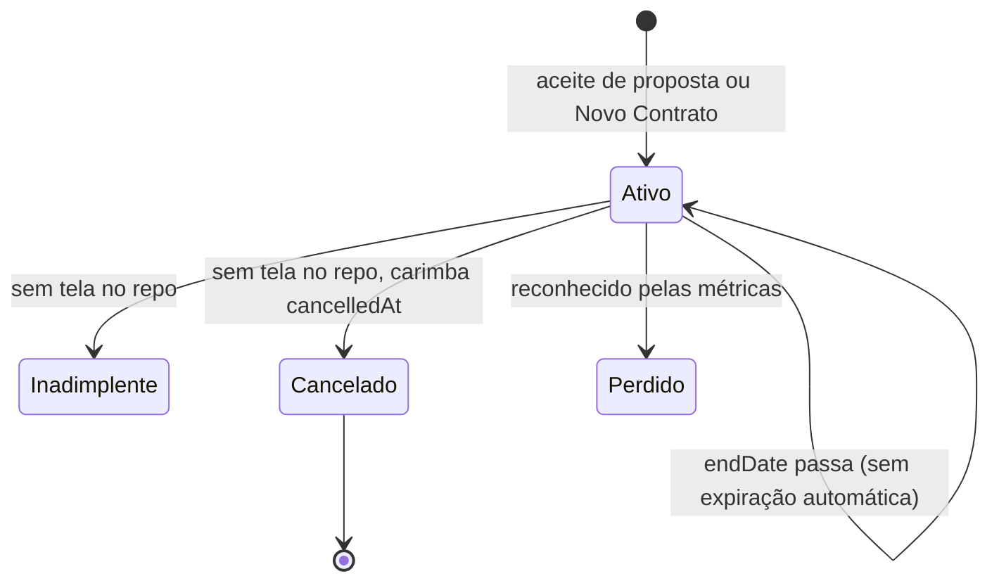

## 23. Realtime, carga de dados e falhas de rede

- **Carga inicial** (`DataContext`): depende de `authLoading` resolvido e de `tenantId`. Cada tabela (dezenas) é buscada em paralelo com limite de 10 requisições simultâneas (`dbLimit`), paginada de 1000 em 1000 (1ª página com `count`, demais em paralelo), com **3 tentativas** por página (espera 500 ms × tentativa). Se uma página falha após as tentativas, mantém as outras e marca a tabela como falha. Cada tabela aplica seu estado **assim que termina**; ao final, um único toast lista as tabelas que falharam ("atualize a página").
- **Prévias rápidas:** `leads`, `products`, `reunioes`, `finance_entries`, `tasks` e ~19 tabelas menores têm uma prévia via rotas de servidor (`/api/crm/leads-list`, `/api/data/table-preview`...), descartada se a busca autoritativa chegar primeiro. `products`, `crm_funis` e `squads` usam cache em `sessionStorage` por 5 min.
- **Módulos de nicho sob demanda:** bancos, transferências, bloqueios, auditoria, centros de custo, marketing, educação e agentes só carregam quando a tela chama `ensureNicheModulesLoaded()`.
- **Troca de tenant:** o efeito **zera todos os estados** antes de buscar (evita misturar dados) e ignora respostas atrasadas via `cancelled`. Reseta também `contractsLoaded`/`proposalsLoaded` e as guardas de reconciliação.
- **Realtime:** um único canal `global-db-changes` (`postgres_changes`, `event: '*'`) em ~30 tabelas; **sem filtro por tenant no servidor** — o cliente filtra.
  - `leads`, `finance_entries`, `reunioes`, `proposal_items`: **patch incremental** (`applyRealtimeUpsert`): DELETE remove por id; INSERT/UPDATE só se `tenant_id` bater; INSERT de lead mostra toast "Novo lead".
  - Demais (`tasks`, `contracts`, `proposals`, `squads`, `appointments`, `products`, `turmas`, `students`, `cargos`, `crm_funis`, financeiras auxiliares, marketing, etc.): `debouncedRefetch` de **1,5 s** por tabela, refazendo a busca paginada do tenant.
  - Motivo documentado: uma sincronização em massa gerava dezenas de refetches simultâneos e saturava o banco (incidente de 2026-09-19).
- **Escritas:** `createCrudHelper` faz **update otimista**; `add`/`update` **não revertem** em erro (só toast); `del` reverte e avisa quando a RLS filtra 0 linhas. `addTask` reverte; `addFinanceEntry`, `updateContract` e `deleteContract` não.
- **Rede/servidor fora do ar:** rotas de resumo têm fallback client-side (DRE, inadimplência, fluxo de caixa, campanhas, mensalidades, clínica); a Mensageria mostra `isOffline` e tenta de novo; `AuthContext` cai nos módulos padrão se `fetchTenants` vier vazio; `requireUser` responde 503 se o Supabase do servidor não estiver configurado. Não há fila offline nem reenvio automático de gravações.
- **Tarefas periódicas no navegador** (só com o app aberto): lembrete de teleconsulta (30 s), lead frio (60 s), gatilhos de score (60 s), alerta de meta de squad (ao mudar `squads`).

## 24. Fluxos públicos (sem login)

### 24.1 Proposta — `/proposta/:token`

`src/pages/public/PropostaPublica.tsx`, `src/lib/publicProposal.ts`.

1. `GET /api/public-proposal/:token` (`service_role`): token com menos de 16 caracteres → 400; sem proposta → 404 ("Proposta não encontrada ou link expirado"). **Cada carga incrementa `view_count`** e atualiza `last_viewed_at`/`first_viewed_at` (inclusive recargas e o próprio dono abrindo o link). Devolve proposta, itens, nome/cor do tenant e `empresa_dados`. Sem a API, o cliente tenta a RPC `get_public_proposal`.
2. A página mostra tema do tenant, itens, valor, validade (`isVencida` desabilita o botão), consultor e PDF.
3. **Aceite:** `POST /api/public-proposal/:token/accept` só faz `UPDATE proposals SET status = 'Aceita'`. O cliente envia `clientName` (e `clientDoc` quando existir), mas **o servidor os ignora** — não há assinatura, IP, data do aceite nem nome gravados. O servidor **não valida** validade, nem se a proposta já estava Aceita/Recusada (uma "Recusada" volta a "Aceita").
4. **Efeitos posteriores:** o contrato, o lançamento e o ajuste do lead **não são criados na rota pública**. Nascem quando um usuário do tenant abre o app e a reconciliação global do `DataContext` (`useEffect` sobre `proposals` com `status = "Aceita"`) roda `syncAcceptedProposal` — sem sessão aberta, ficam pendentes.
- **Limitação:** as rotas públicas de proposta **não têm rate limit específico** (o limiter cobre `/api/v1/*`, `/api/leads`, `/api/ai`, `/api/whatsapp`, `/api/google-calendar` e `/api/public/lead-capture`).

### 24.2 Formulário — `/f/:niche`

`src/pages/common/InteractiveForm.tsx`: perguntas fixas por nicho (`spy` — formulário padrão do próprio S.P.Y., usado pelo botão "Implantar" —, `varejo`, `automotivo`, `solar`, `imobiliaria`, `clinica`, `educacao`; nicho desconhecido cai em `spy`). **Atualizado em 2026-09-24:** o assistente MIA e o nicho Apple foram removidos (antes existiam os slugs `mia-6` e `apple`, e o *fallback* era `apple`); Varejo e Automotivo ganharam formulário. URLs antigas `/f/mia-6` e `/f/apple` agora caem no formulário `spy`. Um passo por pergunta (escolha ou texto/e-mail/telefone). Ao final, `POST /api/public/lead-capture` (limite **5/min**):

- exige `name`; o servidor lê `SPY_FORM_TENANT_ID` (ou `AXIS_FORM_TENANT_ID`) — **sem essa variável responde 503**;
- insere em `leads` com `service_role`: `source = "Formulário do site (<nicho>)"`, `status "Novo"`, `priority "Média"`, `scoreIA 50`, `notes = resumo das respostas` (corta em 4000), sem `seller` (o trigger de rodízio pode atribuir);
- **não há deduplicação** por e-mail/telefone (diferente de `/api/v1/leads`);
- erro → tela "Não foi possível enviar" com "Tentar novamente"; sucesso → "Inscrição Recebida!".

### 24.3 Imóvel e corretor — `/imovel/:id`, `/corretor/:slug`

- **Imóvel:** `fetchPublicImovel` → RPC `get_public_imovel(p_id)` (SECURITY DEFINER; migration `20260921_fixes_m5_m7_baixo_get_public_imovel.sql`). **Cada visualização incrementa `imobiliario_imoveis.visitas`**, que é a mesma métrica da tela interna. Devolve os dados do imóvel e do corretor **ativo** com o mesmo nome. Botão "WhatsApp" abre `wa.me` com mensagem pronta. O link é copiado em `Imoveis.tsx`.
- **Portfólio:** RPC `get_public_corretor_portfolio(p_slug)` (só corretores `Ativo`), lista todos os imóveis do corretor **(qualquer status, inclusive Vendido/Locado)** com contato e "WhatsApp". Link copiado/abre em `Corretores.tsx`.
- Sem resultado → tela de "não encontrado". As RPCs não criam leads: o contato acontece pelo WhatsApp externo.

### 24.4 Catálogo — `/catalogo/:tenantId`

`fetchPublicCatalog` → RPC `get_public_catalog(p_tenant_id)`: retorna o nome do tenant e produtos `active = true` (id, nome, sku, descrição, preço, categoria, `emEstoque = currentStock > 0`; **não expõe o saldo**). Tenant inexistente ou excluído → `null` → tela de "não encontrado". O link é montado no PDV (`Vendas.tsx`, `catalogUrl`). **Qualquer pessoa com o `tenantId` (UUID) vê o catálogo**; não há token separado nem pedido online.

## 25. Matriz de eventos e efeitos colaterais

| Evento | Cria / atualiza | Observações |
|---|---|---|
| `POST /api/v1/leads` (chave de API → tenant) | `leads`: **upsert** por telefone (dígitos) e depois e-mail; se existir, atualiza dados e só avança valor/status/etapa se vier `reservation` ou se o lead nunca teve histórico; mescla `customFields` e `reservationsHistory` (máx. 30); com `customFields.reservation` faz `upsert` em `reunioes` (Agendada/Concluída/Cancelada) | 60 req/min por chave; `SPY_API_KEYS` (`chave:tenantId`) obrigatório (503 se ausente); resposta `deduped: true/false` |
| `POST /api/v1/lead-activities` | `lead_activities` (id `tnp_live_<externalId>`, idempotente) | `skipped: true` se não achar lead |
| `POST /api/v1/finance-entries` | `finance_entries` (`tnp_fat_<externalId>`) por **upsert** — o último valor vence | tipo padrão `Receber`, status `Pago` |
| Lead criado manualmente (`addLead`) | `leads` (`scoreIA 50`), notificação "Novo Lead", 400 ms depois recálculo de score | `filial_id` = filial ativa |
| Lead criado sem `seller` (qualquer caminho) | trigger `assign_lead_round_robin` atribui closer elegível (modo `round-robin`; `manual` não atua) | migration `20260905_*`; **importação CSV não aciona** (envia `seller`) |
| Lead muda de status/etapa | `leads`; recálculo de score em 400 ms (§20.2) | pode mover SDR `s1/s2` → `s_qual` |
| Lead vai de `sdr` para `comercial` | toast e notificação "Lead Qualificado" | |
| Lead vira `Fechado` | notificação/toast de "e-mail de boas-vindas" (**simulado**); cria/vincula cliente (`clientes`) com guarda anti-duplicidade (§6) | |
| Score < 40 | tarefa "Nutrição de Reengajamento" + notificação | só com o app aberto |
| Score bate regra de Gatilho IA | `moveLead` para a etapa-alvo + notificação | só funil `sdr`, 1× por sessão |
| Atividade registrada (`addLeadActivity`) | `lead_activities` + recálculo de score | |
| Venda multi-produto concluída (§4) | `proposals` + `proposal_items`; lançamentos por ciclo/parcela; lead `Fechado`, `value` = soma das propostas, `productIds` acumulados | |
| Proposta criada/alterada com `valor` | recalcula `leads.value` = soma das propostas do lead | |
| Proposta excluída | apaga itens (cascade), lançamentos com `proposal_id`, contrato auto-gerado; recalcula lead; se era a última e o lead estava `Fechado`, **reabre o lead** (`Em Aberto`, `clientId` nulo) | |
| Proposta aceita (link público ou status "Aceita") | servidor só muda o status; **`syncAcceptedProposal` roda no app** (reconciliação): `contracts` (`Ativo`, MRR ÷ meses), `finance_entries` "Contrato / Recorrente" e "Implantação / Setup", ajuste de `leads.value` | idempotente por `proposal_id` |
| Visualização de `/proposta/:token` | `proposals.view_count`, `first_viewed_at`, `last_viewed_at` | a cada carga |
| Visualização de `/imovel/:id` | `imobiliario_imoveis.visitas + 1` | RPC pública |
| Formulário `/f/:niche` enviado | `leads` (origem "Formulário do site (nicho)") | sem dedupe |
| Importação CSV de leads | `leads` em lotes de 25 | sem filial, sem score |
| Importação de movimentações | `finance_bank_accounts`, `finance_categories`, `finance_centros_custo` (get-or-create) + `finance_entries` + `finance_audit_log` | sem dedupe |
| Importação de extrato | `finance_extratos_importados` | conciliar só marca o extrato |
| Lançamento financeiro criado/editado/excluído | `finance_entries` + `finance_audit_log` (diff); bloqueado se `Pago` em período fechado | transferências/comissões não geram auditoria |
| Reunião agendada (`AgendarReuniaoModal`) | `reunioes`; evento no Google se conectado; lead promovido ao Comercial | e-mails do Google saem pelo próprio Google |
| Reunião encerrada | `reunioes.status = Concluída`, `relatorio_ia`, `transcricao`, `notas_closer` | |
| Sync Google Calendar (servidor) | `reunioes` (`gcal-<id>`), `google_calendar_connections.last_sync_at`, log de auditoria | unidirecional |
| Mensagem WhatsApp recebida (webhook WAHA) | `chat_contacts` (upsert), `chat_messages`, e, com agente Aurora ativo, resposta enviada + `chat_messages (ai)` | exige WAHA real |
| Mensagem enviada pelo atendente | `chat_messages (human)`, `chat_contacts.last_message`; envio real só com WAHA | |
| Venda no PDV | `vendas`, `venda_items`, baixa de estoque, `estoque_movimentacoes`, `finance_entries`, `varejo_pedidos` | atenção ao vocabulário `Receita/Recebido` (§19.5) |
| Recebimento de compra (varejo) | `estoque_movimentacoes` (entrada) + `compras.status` | sem conta a pagar |
| Matrícula com mensalidade | `students` + `mensalidades` (RPC) | possível bug de id (§19.6) |
| "Marcar Pago" em mensalidade | `mensalidades.status/data_pagamento` | sem financeiro |
| Repasse de consignação | `finance_entries` (`Pagar`, `Pendente`) + `imobiliario_veiculos.repasse_realizado` | só pelo painel do veículo |
| Análise de fatura solar / avanço de estágio | `solar_analises`; em "Proposta Enviada" cria `proposals`; tarefas nos estágios | sem lead/financeiro |
| Salvar comissão/OTE | `finance_commission_entries` | sem despesa |
| Contrato cancelado (`updateContract`) | `cancelled_at` carimbado uma vez | churn |
| Tenant criado pelo master | `tenants`, `auth.users`, `users` | §11.1 |
| Módulos alterados | `tenants.modules` (por nome) | menu muda no próximo carregamento |
| Conexão/desconexão Google (servidor) | `google_calendar_connections` + auditoria | |

## 26. Mapa de rotas → fluxo

| Rota (`src/App.tsx`) | Fluxo |
|---|---|
| `/`, `/landing`, `/lp` | páginas de marketing do S.P.Y. (`/f/*` da landing leva ao §24.2) |
| `/login` | §12.1; recuperação em `/redefinir-senha` (§12.2); `/register` → `/login` |
| `/app`, `/app/dashboard`, `/app/performance-ia`, `/app/indicadores`, `/app/relatorios` | dashboards e BI (§20.1, §21.7) |
| `/app/crm/pipeline` (`/app/leads`, `/app/pipeline`) | funil, score e gatilhos (§3, §20) |
| `/app/crm/contatos`, `clientes`, `empresas`, `oportunidades` | base de clientes (§6) |
| `/app/crm/propostas` (`/app/propostas`) | §4, §5 |
| `/app/crm/contratos`, `/app/documentos`, `/app/financeiro/faturas` | §22 |
| `/app/crm/atividades`, `/app/crm/follow-ups` | §16 |
| `/app/crm/importacao` | §13 |
| `/app/crm/dashboard` | dashboard comercial (`pages/crm/Dashboard.tsx`) |
| `/app/crm/agenda`, `/app/agenda/*`, `/app/reunioes*` | §15 |
| `/app/tarefas` | §16.2 |
| `/app/produtos` | catálogo (§8) |
| `/app/mensageria` | §17 |
| `/app/automacoes`, `/app/marketing/*` | §18 |
| `/app/financeiro/*` | §7, §14, §21 (`importar` → §14.1, `conciliacao` → §14.2, `dre`/`mrr`/`inadimplencia`/`projecao` → §21.7, `plano-contas`/`categorias`) |
| `/app/imobiliario/*` | §19.2 (`veiculos` redireciona para `/app/automotivo/veiculos`) |
| `/app/automotivo/*`, `/app/concessionaria/*` | §19.3 |
| `/app/energia-solar/*`, `/app/solar/*` | §19.4 |
| `/app/varejo/*` | §19.5 |
| `/app/clinica/*`, `/app/clinicas/*` | §19.1 |
| `/app/educacao/*` | §19.6 |
| `/app/equipe` | RH: colaboradores, squads, OTE (§21.6) |
| `/app/configuracoes/*` | §9; `empresa/modulos` redireciona para `/app/admin?tab=tenants`; `financeiro/*` → §21.4/§21.6; `crm/gatilhos-ia` → §20.3; `crm/rodizio` → trigger de rodízio; `integracoes/*` (apps, SMTP, webhooks, SDR, conectores, links) → testes reais em `/api/integrations/*`; `sistema/aurora` → §20.1 |
| `/app/dev/*` | módulo Engenharia (`dev`): projetos, sprints, issues, repositórios, ambientes |
| `/app/admin` (`requireMaster`) | §11 |
| `/app/parceiros` (`requirePartner`) | visão de tenants mapeados (§9, §11.5) |
| `/proposta/:token` | §24.1 |
| `/f/:niche` | §24.2 |
| `/imovel/:id`, `/corretor/:slug` | §24.3 |
| `/catalogo/:tenantId` | §24.4 |

## 27. Lacunas, simulações e pontos de atenção (consolidado)

**Simulado ou fictício**

- WhatsApp em modo `simulator`; painel "Master AI" da conversa; copilot do WhatsApp sem chave de IA; lembrete de teleconsulta; e-mail de boas-vindas; régua de cobrança da Educação; "Simular disparo" das automações de marketing; métricas iniciais de landing pages; envio de prévia do formulário; chave/protocolo de NFC-e do PDV; faturamento/assinaturas do painel master; "Conciliar automaticamente (IA)" (é casamento por valor).

**Parcial ou sem consumidor**

- `OnboardingWizard` desativado; `updateTenantPlan` sem chamador; grade de Disponibilidade sem uso; motor de automações de marketing inexistente; rotas `/api/ai/pipeline-audit`, `settings-audit`, `marketing-advisor`, `suggest-new-config`, `/api/cnpj/validate` e `/api/ai/aurora-tenant-chat` sem chamador no front; edge function `analyze-crm-call` sem chamador e `RevenueIntelligenceModal` não montado; calendário de conteúdo e conexão de redes sociais são placeholders; presença de turma "em breve"; "Em Andamento" de reunião nunca atribuído; `Automations.tsx` sem rota.

**Riscos e possíveis defeitos (por leitura de código, não executados)**

- `Eventos.tsx` lê colunas do modelo antigo de reunião.
- Desconectar o Google no `AgendaCRM`/`AgendaConfiguracoes` apaga todas as reuniões com `googleEventId`.
- Matrícula de aluno: `id` sobrescrito por `addStudent` → RPC de mensalidades recebe id inexistente.
- `finalizar_venda` grava `Receita`/`Recebido` (vocabulário diferente do resto do financeiro).
- `NovoTenantModal` esconde erro de criação; admin inicial sem `is_tenant_admin` explícito.
- Aceite público não valida validade/estado nem grava dados do aceitante; efeitos (contrato/lançamentos) dependem de um usuário abrir o app.
- Importações (leads, movimentações, extrato) sem deduplicação total; `parseValorBR` só entende pt-BR.
- `addFinanceEntry`/`updateContract`/`updateLead` não revertem o estado local em falha de gravação.
- Chaves de IA no bundle (`VITE_GEMINI_API_KEY`, `VITE_GROQ_API_KEY`) usadas por `lib/revenueIntelligence.ts`.
- Módulos e "simulação" do master usam o **nome** do tenant como chave.
- Status `Atrasado` (financeiro, tarefas) e `Expirada`/`Expirado` (proposta/contrato) não têm rotina automática por data.
- `EEmpreendaEditor` e o formulário padrão E-EMPREENDA+ estão presos ao tenant Pluppex — não seguem o princípio de o S.P.Y. ser genérico.
