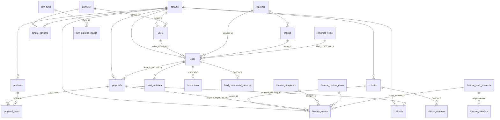

# 05 — Esquema de Backend

> Versão 2.0 · 2026-09-24 · **Verificado contra o banco vivo** (projeto Supabase `snwkzvgompfgqoqbpihe`, "Axis / Pluppex", Postgres 17) por consultas somente-leitura de metadados (`pg_class`, `information_schema`, `pg_policies`, `pg_proc`, `pg_constraint`, `pg_indexes`, `storage.buckets`) + `server.ts`, `supabase/migrations/` e `src/contexts/DataContext.tsx`. Nenhum dado de negócio foi lido.
>
> ⚠️ **Fonte de verdade = banco vivo.** `schema.sql` e `backend-architecture.md` (raiz) estão desatualizados: o segundo descreve `companies`/`roles`/`invoices`, que **não existem**. Onde o repositório diverge do banco, isso está marcado em §11.

## 1. Números do banco (2026-09-24)

| Item | Valor |
|---|---|
| Tabelas em `public` | **129** |
| Com RLS habilitado | **129 (100%)** |
| Sem coluna `tenant_id` | 5 — `tenants`, `module_manifest`, `tool_registry`, `event_action_map`, `google_oauth_app_config` (plataforma/config global) |
| RLS ligado e **0 policies** (só `service_role` acessa) | 4 — `api_key_usage_log`, `external_integrations`, `julia_round_robin_state`, `tenant_integrations` |
| Índices em `public` | 320 (149 únicos) |
| Funções próprias | ~50 (schema `public`, exclui a extensão `http`) |
| Extensões | `plpgsql`, `uuid-ossp`, `pgcrypto`, `pg_stat_statements`, `supabase_vault`, `pg_net`, `pg_graphql`, `pg_cron`, `http`, `vector` |
| Buckets de Storage | `avatars` (5 MB), `proposals` (20 MB), `products` (25 MB), `finance` (25 MB) |

## 2. Visão geral e mapa de domínios

Postgres (Supabase) com isolamento por `tenant_id` + RLS; o navegador fala direto com o banco (anon key + JWT); Express (`server.ts`) só para IA, admin e API pública por chave.

| Domínio | Tabelas |
|---|---|
| **Plataforma / identidade** | `tenants`, `users`, `partners`, `tenant_partners`, `nichos`, `module_manifest`, `tool_registry`, `tenant_token_limits`, `tenant_ai_config`, `tenant_dynamic_links`, `tenant_integrations`, `user_settings`, `app_settings`, `landing_configs`, `google_oauth_app_config` |
| **Organização** | `empresa_filiais`, `cargos`, `colaboradores`, `squads`, `squad_metas`, `financial_goals` |
| **CRM** | `leads`, `pipelines`, `stages`, `crm_funis`, `crm_pipeline_stages`, `lead_activities`, `interactions`, `lead_tags`, `tags`, `lead_custom_values`, `custom_fields`, `lead_commercial_memory`, `clientes`, `cliente_contatos`, `indicacoes`, `afiliados` |
| **Produtos, propostas, contratos** | `products`, `proposals`, `proposal_items`, `contracts`, `estoque_items`, `estoque_movimentacoes` |
| **Financeiro** | `finance_entries`, `finance_categories`, `finance_centros_custo`, `finance_bank_accounts`, `finance_transfers`, `finance_budgets`, `finance_attachments`, `finance_extratos_importados`, `finance_period_locks`, `finance_audit_log`, `finance_commission_entries` |
| **Agenda / produtividade** | `appointments`, `reunioes`, `tasks`, `google_calendar_connections`, `notifications` |
| **Comunicação** | `whatsapp_instances`, `chat_contacts`, `chat_messages`, `messages`, `internal_channels`, `internal_messages`, `radar_grupos_monitorados` |
| **IA / Aurora** | `aurora_agents`, `aurora_events`, `aurora_insights`, `aurora_audit_log`, `aurora_model_failures`, `ai_agent_prompts`, `ai_knowledge_base`, `ai_usage_log`, `julia_interaction_log`, `julia_round_robin_state`, `event_action_map` |
| **Integração** | `webhooks`, `webhook_logs`, `external_integrations`, `external_integration_logs`, `api_key_usage_log` |
| **Marketing** | `marketing_campaigns`, `marketing_content`, `marketing_landing_pages`, `marketing_automations`, `marketing_forms` |
| **Clínica** | `pacientes`, `prontuarios`, `clinica_profissionais`, `clinica_servicos`, `clinica_planos_tratamento`, `exames_pedidos` |
| **Imobiliário / Automotivo** | `imobiliario_imoveis`, `_proprietarios`, `_captacoes`, `_empreendimentos`, `_corretores`, `_visitas`, `_comissoes`, `_leads`, `imobiliario_veiculos`, `automotivo_avaliacoes`, `veiculo_financiamentos` |
| **Energia solar** | `solar_projetos`, `solar_analises`, `solar_vistorias`, `solar_instalacoes`, `solar_homologacoes`, `solar_manutencoes` |
| **Varejo** | `vendas`, `venda_items`, `vendas_em_espera`, `caixa_operacoes`, `compras`, `varejo_fornecedores`, `varejo_pedidos` |
| **Educação** | `turmas`, `students`, `mensalidades`, `education_content`, `certificates` |
| **Dev** | `dev_projects`, `dev_issues`, `dev_sprint_tasks`, `dev_repositories`, `dev_environments` |
| **Auditoria de permissão** | `permission_check_log` |

## 3. Diagrama ER do núcleo

**Nota:** vários vínculos operacionais **não têm FK** e vivem como colunas soltas: `leads."clientId"` (text, sem FK para `clientes`), `leads."productIds"` (`text[]`), `crm_funis.tenant_id` (uuid, mas o vínculo com lead é por `leads."pipelineId"` texto).

## 4. Núcleo de identidade e plataforma

### 4.1 `tenants`
`id uuid`, `name`, `niche`, `plan`, `status`, `timezone`, `primary_color`, flags `module_crm/sdr_ia/adv_dashboard/education/finance/tasks/marketing`, `modules jsonb`, `webhook_url`, `evolution_api_url`, `created_at/updated_at/deleted_at`. Policies: leitura `anon` só de tenants ativos (formulário público), CRUD `authenticated` por policy própria (`tenant_select/insert/update/delete`).

### 4.2 `users`
`id` (= `auth.users.id`), `tenant_id!`, `name!`, `email!`, `role` (texto livre), **`is_master`**, **`is_tenant_admin`** (coluna real, `bool!`), `partner_id`, `active`, `phone`, `bio`, `avatar_url`, `two_factor_enabled!`, `preferences jsonb!` (ex.: `pipelineView`, `systemPreferences`), `default_whatsapp_instance_id`, `last_login`, `deleted_at`. `password_hash` é legado (nullable; a senha real vive em `auth.users`).

### 4.3 Parceiros
`partners(id, tenant_id, name)` e `tenant_partners(partner_id, tenant_id)` — só super admin escreve; `users.partner_id` liga o usuário parceiro.

**Nichos (`nichos`, verificado no banco vivo em 2026-09-24):** catálogo global = Agronegócio, Clínica, Educação, Imobiliária, Parceira, Solar, Tecnologia, **Varejo**; há ainda "Parceira" customizada em 3 tenants. **Não há Apple nem MIA** no catálogo nem em nenhum tenant (`tenants.niche` em uso: Parceira, Parceira Geral, Varejo). **Automotivo tem módulo e tabelas, mas ainda não consta no catálogo `nichos`** — cadastrar como nicho global para poder ser escolhido. Resquício: 1 dos 4 funis em `crm_funis` ainda se chama "Funil SDR IA — MIA-6" (seed da migration `20260827_crm_funis_activate_and_backfill`; 0 leads, 0 etapas). A migration `20260924_remove_mia_funnel_add_automotivo_niche.sql` remove esse funil e cadastra Automotivo — **criada, ainda não aplicada no banco**.

### 4.4 Catálogo de módulos e ferramentas de IA
`module_manifest(module_key, display_name, category, page_folder, routes jsonb, tables jsonb, cargo_selectable, db_enforced, backend_routes jsonb)` — inventário declarativo de cada módulo (rotas, tabelas, se o banco impõe acesso). `tool_registry(workflow_id, name, category, module_key→module_manifest, min_plan_tier, operation_type, active)` — ferramentas/workflows n8n disponíveis por plano. `tenant_ai_config` (por tenant: `aurora_enabled`, `allowed_read/write/execute_modules text[]`, `custom_prompt`; provisionada por trigger ao criar tenant). `tenant_token_limits(tenant_id, monthly_limit, plan_name)` + `ai_usage_log` = medição de tokens de IA.

## 5. CRM

### 5.1 `leads` (41 colunas)
Colunas **duplicadas por legado** (snake e camel convivem; o app lê/escreve as camel): `pipeline_id`/`"pipelineId"`, `stage_id`/`"stageId"`, `score_ia`/`"scoreIA"`, `seller_id`/`seller`. Principais: `name!`, `email!`, `phone`, `mobile_wa`, `company`, `cnpj`, `document_id`, `value num`, `status`, `priority`, `temperature`, `source`, `loss_reason`, `last_contact_at`, `next_action_at`, `"timeIdle"`, `"iaSummary"`, `lead_interesse_cliente`, `"customFields" jsonb`, `"clientId"` (text, **sem FK**), `"clientName"`, **`"productIds" text[]`**, `notes`, `filial_id`, `deleted_at`. Policies: `tenant_isolation` (ALL) e `public_insert_leads_e_empreenda` (INSERT para `anon`, usado pelo formulário público).
Triggers: `trg_assign_lead_round_robin` (BEFORE INSERT — rodízio), `trg_external_lead_created`/`_status_changed` e `webhook_lead_created`/`_status_changed` (AFTER — despacho de integrações/webhooks), `trg_permission_log_crm` (log de permissão), `update_leads_modtime`.

### 5.2 Funis
Dois modelos coexistem: **`crm_funis` + `crm_pipeline_stages`** (usado pela UI de configuração; `tenant_id` uuid, `etapas text[]`, `etapas_config jsonb`, parâmetros SDR `sdr_score_minimo`, `sdr_delay_resposta`, `sdr_msg_boas_vindas`, `client_ids text[]`) e **`pipelines` + `stages`** (FK real de `leads.pipeline_id/stage_id`, `stages."order"`).

### 5.3 Clientes
`clientes(id text, name!, industry, city, state, phone, email, status, documento, tipos text[]!, tipo_pessoa, cep, logradouro, numero, bairro, complemento, cidade_ibge, tenant_id, created_at)`. Índices: apenas `clientes_pkey`, `idx_clientes_tenant_id`, `idx_clientes_tenant_created` → **não há unicidade de `documento`/`email` no banco** (dedup é só de aplicação; ver §11-1). `cliente_contatos(cliente_id→clientes CASCADE, nome!, cargo, departamento, papel_decisao, email, telefone, whatsapp, principal!, observacoes)`.

### 5.4 Demais
`lead_commercial_memory` (BANT: `produto_interesse`, `orcamento`, `necessidade`, `autoridade`, `urgencia`, `objecoes jsonb`, `compromissos jsonb`, `bant_criterios_atendidos`; INSERT `anon` para o formulário), `lead_activities(id text, lead_id text!, type, title, description, date text, seller)`, `interactions`, `tags`/`lead_tags`, `custom_fields`/`lead_custom_values`, `indicacoes` + `afiliados` (comissão por indicação/afiliado), `julia_interaction_log` (log do agente "Julia": mensagem, contexto, campos extraídos, score, ação, handoff).

## 6. Produtos, propostas e contratos

### 6.1 `products` (37 colunas)
Colunas reais de recorrência/implantação: `is_recurring!`, `recurring_period`, `implementation_fee`. Comerciais: `price`, `cost`, `margin`, `commission`, `sku`, `category`, `type`. Estoque: `stock!`, `stock_min!`, `stock_max`, e camel legados `"stockMin"`, `"stockMax"`, `"currentStock"`. Outras: `attachments jsonb!`, **`type_attributes jsonb!`**, `tags text[]`, `"clientId"`, `"clientName"`, `"tenantName"`, `filial_id`, `deleted_at`.

**Chaves de `type_attributes`** (lidas por `mapProductRow`, expostas como propriedades):

| Chave | Tipo | Significado |
|---|---|---|
| `isRecurring` | bool | Cobrança recorrente |
| `billingCycle` | `Mensal`/`Trimestral`/`Semestral`/`Anual`/`Pontual` | Ciclo |
| `contractMonths` | int | Duração/vigência do contrato |
| `hasImplementation`, `implementationFee` | bool, num | Taxa de setup |
| **`hasLoyalty`** | bool | Contrato com **fidelidade** |
| **`loyaltyMonths`** | int | Prazo mínimo de permanência |
| **`earlyTerminationFeePercent`** | num 0–100 | Multa % sobre mensalidades restantes |
| por `type` | vários | ex.: endereço/área (Imóvel) |

> Fidelidade ≠ vigência: `contractMonths` é a duração normal; fidelidade é o compromisso mínimo com penalidade. **Hoje só é armazenada** (não gera cobrança de multa — Plano, Fase 2).

### 6.2 `proposals` (20 colunas)
`id text`, `tenant_id`, `lead_id→leads (SET NULL)`, `titulo!`, `cliente`, `vendedor`, `valor`, `status`, `validade`, `tipo!` (`itens`/`texto`/`arquivo`), `conteudo_texto`, `link_pdf`, **`view_token! (UNIQUE)`**, `first_viewed_at`, `last_viewed_at`, `view_count!`, `decisor_nome`, `decisor_cargo`, `filial_id`. Trigger `trg_baixar_estoque_proposta_aceita` (AFTER UPDATE): ao passar a **Aceita**, dá baixa de estoque dos itens. Leitura pública apenas via RPC `get_public_proposal(p_token)`.

### 6.3 `proposal_items`
`proposal_id→proposals (CASCADE)`, `product_id→products (SET NULL)`, `product_name!`, `quantidade!`, `preco_unitario!`, **`billing_type!`** (`recurring`/`one_time`), `contract_months`, `frequency`. ⚠️ Em item recorrente, `quantidade` = **ciclos × unidades** (convenção legada; ver TRD §9-D1).

### 6.4 `contracts`
`lead_id`, `user_id`, `title!`, `description`, `value!`, `mrr_value`, `status!`, `signed_date`, `start_date`, `end_date`, `cancelled_at`, `file_url`, `notes`, `filial_id`, **`proposal_id→proposals` com índice único `contracts_proposal_id_unique`** (idempotência do aceite). Índices de dashboard: `idx_contracts_revenue_dashboard`, `idx_contracts_agent_lookup`. O app também usa `client`, `plan`, `mrr` (texto), `totalValue` (camadas de apresentação em `DataContext`).

## 7. Financeiro

### 7.1 `finance_entries` (29 colunas)
`id text`, `tenant_id`, `description!`, `type!` (`Receber`/`Pagar`), `status`, `value!`, `date` (**varchar** — legado), `date_normalized date`, `competencia_date`, `category`, `category_id→finance_categories`, `centro_custo_id→finance_centros_custo`, `conta_bancaria_id→finance_bank_accounts`, **`contato_id→clientes`**, `counterparty`, `numero_documento`, `payment_method`, `notes`, `tags text[]!`, `division_group_id`, **recorrência:** `is_recurring!`, `recurring_frequency`, `recurring_group_id`; **parcelamento:** `installment_group_id`, `installment_number`, `installment_total`; **origem:** `proposal_id→proposals (SET NULL)`; `filial_id`. Trigger `trg_permission_log_financeiro`.

### 7.2 Demais
`finance_categories(nome, tipo, subtipo)`, `finance_centros_custo(codigo, orcamento, gasto, responsavel)`, `finance_bank_accounts(tipo, saldo_inicial, sinal_saldo_inicial, is_principal, arquivada)`, `finance_transfers(conta_origem_id, conta_destino_id, valor, pago, data_pagamento)`, `finance_budgets(category_id, mes, valor_orcado)`, `finance_attachments(transacao_id→finance_entries CASCADE, storage_key, url)`, `finance_extratos_importados(conciliado, match_sugerido)`, `finance_period_locks(data_inicial, data_final)`, `finance_commission_entries(period, nivel, meta, realizado)`, `finance_audit_log` (**append-only**: policies `no_update` e `no_delete`; `diff jsonb`).

## 8. Comunicação, IA e integrações

| Tabela | Função |
|---|---|
| `whatsapp_instances` | instâncias (`provider`, `status`, `qrcode`, `webhook_url`, `webhook_secret!`, `api_key`) |
| `chat_contacts` / `chat_messages` | **existem** com RLS (contatos por canal, `unread_count`, mensagens com `wa_message_id`) — o simulador do backend pode usá-las |
| `messages` | mensagens ligadas a lead (`direction!`, `message_type`, `external_id`) |
| `internal_channels` / `internal_messages` | chat interno por squad/canal |
| `radar_grupos_monitorados` | grupos de WhatsApp monitorados por vendedor |
| `aurora_agents` | agentes de IA por tenant (`active`, `workflow`, `permissions jsonb`) |
| `aurora_events` | barramento de eventos (`event_type`, `entity_*`, `actor_*`, `correlation_id`, `parent_event_id`, `success`) |
| `aurora_insights` | insights (`type`, `severity`, `evidence`, `confidence`, `valid_until`) |
| `aurora_audit_log`, `aurora_model_failures`, `ai_usage_log` | auditoria, falhas de modelo e consumo de tokens |
| `event_action_map` | mapeia `action → event_type` (ponte auditoria→evento; sem `tenant_id`) |
| `webhooks` / `webhook_logs` | **webhooks de saída reais**: triggers de `leads`/`tasks` chamam `dispatch_webhook_event` (usa `pg_net`), com log de status |
| `external_integrations` / `external_integration_logs` | conectores externos (`base_url`, `auth_type`, `sync_events`, `secret_value`); RLS sem policy (só `service_role`) |
| `api_key_usage_log` | uso da API por chave (prefixo, método, path, status, IP); só `service_role` |

## 9. Módulos verticais e demais tabelas

Estruturas simples (`id`, `tenant_id`, campos do domínio, `status`, `created_at`). Destaques com regra no banco:
- **Varejo:** `vendas` + `venda_items`; RPC `finalizar_venda(p_venda_id)` (baixa estoque, gera lançamento, guarda `finance_entry_id`) e `registrar_movimentacao_estoque(...)`; `estoque_movimentacoes(tipo, quantidade, referencia_venda_id)`.
- **Educação:** `mensalidades` (`competencia`, `parcela`, `vencimento`, `status`); RPCs `gerar_mensalidades_matricula(...)` e `atualizar_inadimplencia_mensalidades()`.
- **Automotivo:** `imobiliario_veiculos` (`is_consignado`, `comissao_percentual`, `repasse_realizado`); RPC `registrar_repasse_consignacao(p_veiculo_id)` → `finance_entries`; trigger `trg_increment_veiculo_test_drive` (visita conta test-drive).
- **Solar:** `solar_analises` liga a `leads` e `proposals` (`proposal_id`, `valor_proposta`, `data_conclusao`).
- **Clínica:** `appointments.patient_id→pacientes`, `prontuarios(paciente_id CASCADE, appointment_id)`; acesso a módulo checado/logado por `trg_permission_log_clinica`.

## 10. Segurança no banco

### 10.1 Funções de isolamento (todas `SECURITY DEFINER`)
`current_tenant_id()`, `current_partner_id()`, `is_super_admin()`, **`has_tenant_access(target_tenant_id)`** (dono direto **ou** super admin **ou** parceiro em `tenant_partners`), `is_own_tenant_or_super_admin(target_tenant_id)`, `email_taken(check_email)`, `platform_metrics_overview()` (agregados da plataforma para o master).

### 10.2 Padrão de policy
Quase toda tabela de negócio: **uma policy `tenant_isolation` (ALL)** com `has_tenant_access(tenant_id)`. Exceções relevantes:

| Tabela | Policies |
|---|---|
| `leads`, `tasks`, `lead_commercial_memory`, `julia_interaction_log` | `tenant_isolation` **+ INSERT `anon`** (formulário público do E-EMPREENDA+) |
| `tenants` | SELECT `anon` só de ativos; CRUD `authenticated` |
| `finance_audit_log` | `tenant_isolation` + `no_update` + `no_delete` (imutável) |
| `nichos` | SELECT/ALL `authenticated` (`tenant_id` nulo = global) |
| `partners`, `tenant_partners`, `tenant_token_limits`, `tenant_dynamic_links`, `tenant_ai_config` | 4 policies (select/insert/update/delete) por papel |
| `api_key_usage_log`, `external_integrations`, `julia_round_robin_state`, `tenant_integrations` | RLS ligado, **sem policy** → negado a `anon`/`authenticated`; só `service_role` |

### 10.3 Triggers (resumo)
| Grupo | Triggers |
|---|---|
| `updated_at` | `update_*_modtime` / `*_updated_at` em ~25 tabelas |
| Regra de negócio | `trg_assign_lead_round_robin`, `trg_baixar_estoque_proposta_aceita`, `trg_increment_veiculo_test_drive`, `trg_provision_tenant_ai_config`, `trg_sync_sprint_task_project_from_issue`, `trg_bridge_audit_log_to_event` |
| Integração | `webhook_lead_created`, `webhook_lead_status_changed`, `webhook_task_created`, `trg_external_lead_created`, `trg_external_lead_status_changed`, `trg_external_task_created` |
| Auditoria de permissão (**modo log**) | `trg_permission_log_{crm,financeiro,rh,clinica,educacao}` → `log_module_permission_check` grava `permission_check_log(would_have_blocked)` **sem bloquear** |

### 10.4 Storage
`avatars` 5 MB · `proposals` 20 MB · `products` 25 MB · `finance` 25 MB (leitura pública por URL; escrita restrita por pasta = `tenant_id`).

### 10.5 Checklist de tabela nova
`tenant_id uuid references tenants(id) on delete cascade` → índice `(tenant_id, …)` → `enable row level security` → policy `tenant_isolation` com `has_tenant_access(tenant_id)` → `get_advisors` (security) sem alerta novo.

## 11. Drift e lacunas (repo × banco × modelo)

| # | Achado | Impacto | Ação |
|---|---|---|---|
| 1 | `clientes` sem unicidade de `documento`/`email` | Duplicados possíveis por corrida (já ocorreu) | Índices únicos parciais `(tenant_id, documento)` e `(tenant_id, lower(email))` após deduplicar |
| 2 | **Migrations de 2026-09-21:** `a1`, `a4`, `cr1`, `cr2`, `cr3` e `m5_m7` **todas aplicadas** em 2026-09-24. Sobra 1 produto com `tenant_id` nulo ("Site Institucional" do tenant G-Tech Master, já excluído; 0 usos em propostas) | Produto órfão invisível para não-master | Reatribuir a um tenant ou excluir |
| 3 | Permissões por módulo em **modo log** (`permission_check_log`) | Nada é bloqueado ainda | Migrar para enforcement após validar `would_have_blocked` |
| 4 | `quantidade` sobrecarregada em item recorrente | Confusão de exibição/relatórios | Coluna `cycles` (Plano, Fase 2) |
| 5 | `leads."clientId"` e `"productIds"` sem FK | Vínculo órfão possível (já houve) | FK `leads.client_id → clientes` ou limpeza garantida por trigger |
| 6 | Colunas duplicadas snake/camel em `leads` e `products` | Escrita divergente | Uma convenção + view de compatibilidade |
| 7 | Dois modelos de funil (`crm_funis` × `pipelines/stages`) | Confusão de fonte | Consolidar |
| 8 | `finance_entries.date` é `varchar` (existe `date_normalized`) | Ordenação/filtro frágil | Usar `date_normalized` e migrar |
| 9 | `users.role` texto livre; `password_hash` legado | RBAC fraco | Tabela `roles`/permissões (Plano, Fase 4) |
| 10 | Settings genéricos do `server.ts` ainda em memória | Perdem-se no cold start | Tabela `tenant_settings` |
| 11 | Sem geração de tipos TS | Deriva de tipos escritos à mão | `generate_typescript_types` no CI |
| 12 | `schema.sql` desatualizado | Doc enganosa | Regenerar dump a partir do banco vivo |

## 12. API HTTP (`server.ts`, base `/api`)

| Grupo | Auth | Rotas |
|---|---|---|
| Pública | `x-api-key` → tenant | `POST/GET /v1/leads` · `POST /v1/lead-activities` · `POST /v1/finance-entries` (upsert por `externalId`) |
| IA / leads | Bearer JWT | `POST /leads/suggest-tags` · `/leads/calculate-score` · `/cnpj/validate` · `/ai/{performance-audit, pipeline-audit, marketing-advisor, settings-audit, suggest-new-config, generic-insight, aurora-chat, corrigir-nota, lead-copilot, reuniao-relatorio}` |
| Settings (memória) | Bearer JWT | `GET/POST /settings/:categoria` · `DELETE /settings/:categoria/:id` |
| Admin | JWT + `requireMaster` | `GET /admin/tenant-admin-user/:tenantId` · `POST /admin/tenant-user/:userId/credentials` · `POST /admin/tenant` |
| WhatsApp | Bearer JWT | instâncias, QR, contatos, mensagens, `simulate-incoming`, `copilot/analyze` |
| Cache | Bearer JWT | `GET /crm/clientes-list?tenantId=` (Redis, TTL 20 s) |
| Edge Function | — | `analyze-crm-call` (Gemini/Groq) |

Rate limit 20–60 req/min por IP (IA/API pública) e 60/min (WhatsApp). Detalhe por rota em `docs/API.md` e no TRD.

## 13. RPCs públicas (chamáveis sem login)

| RPC | Uso | Proteção |
|---|---|---|
| `get_public_proposal(p_token)` | Página `/proposta/:token`; incrementa visualização | Token não adivinhável (`view_token` único) |
| `get_public_imovel(p_id)` / `get_public_corretor_portfolio(p_slug)` / `get_public_catalog(p_tenant_id)` | Páginas públicas | Retornam só campos publicáveis |
| `claim_next_form_sdr(p_tenant_id)` | Rodízio no formulário E-EMPREENDA+ | Aceita apenas o tenant fixo do formulário |

## 14. Operações transacionais (orquestradas na aplicação)

Sem transação de banco entre elas; ordem + idempotência compensam.

**Fechar venda** (`AddProdutoLeadModal`): categoria "Vendas / Serviços" → `createProposalWithItems` (proposta + N itens + recálculo de `leads.value`) → por item: recorrente = N × `finance_entries` (`recurring_group_id`), única = N × parcelas (`installment_group_id`) → `updateLead` (Fechado, `productIds`) → notificação.
**Aceite** (`syncAcceptedProposal`): valida tenant → busca contrato por `proposal_id` (índice único) → novo: contrato + lançamentos (Contrato/Recorrente + Implantação); existente: só backfill, 1× por sessão; trigger baixa estoque.
**Excluir proposta:** itens em cascata; remove lançamentos com `proposal_id`, contrato auto-gerado; recalcula `leads.value`.
**Risco:** falha no meio deixa estado parcial → RPC transacional `close_sale` (Plano, Fase 1.3).

## 15. Variáveis de ambiente (backend)

`SUPABASE_SERVICE_ROLE_KEY` · `SPY_API_KEYS` (`chave:tenantId,…`) · `SPY_CORS_ORIGIN` · `GEMINI_API_KEY` · `GROQ_API_KEY` · `AURORA_WEBHOOK_URL` · Redis (`ioredis`) · SMTP. Cliente (públicas): `VITE_SUPABASE_URL`, `VITE_SUPABASE_ANON_KEY` (e, indevidamente, `VITE_GEMINI/GROQ_API_KEY`).

---

# Apêndice A — Dicionário de dados (banco vivo)

**Legenda:** `!` = NOT NULL · `tstz` = timestamptz · `num` = numeric · `vc` = varchar · `text[]` = array · `jsonb`. Todas as tabelas (exceto as 5 sem `tenant_id`) têm `tenant_id → tenants(id)`; onde há `ON DELETE CASCADE` é a regra dominante. FKs adicionais relevantes no Apêndice B.

### A.1 Plataforma e identidade
| Tabela | Colunas |
|---|---|
| `tenants` | id!, name!, niche!, created_at, updated_at, deleted_at, modules jsonb, webhook_url vc, evolution_api_url vc, primary_color vc, module_crm/sdr_ia/adv_dashboard/education/finance/tasks/marketing bool, status vc, plan vc, timezone vc |
| `users` | id!, tenant_id!, default_whatsapp_instance_id, name!, email!, password_hash vc, created_at, updated_at, deleted_at, active, last_login, is_master, avatar_url, role vc, partner_id, phone, bio, two_factor_enabled!, preferences jsonb!, is_tenant_admin! |
| `partners` | id!, tenant_id, name!, created_at!, updated_at! |
| `tenant_partners` | id!, tenant_id!, partner_id!, created_at! |
| `nichos` | id!, tenant_id, nome!, ativo!, created_at!, updated_at! |
| `module_manifest` | module_key!, display_name!, category!, page_folder, routes jsonb!, tables jsonb!, cargo_selectable!, db_enforced!, backend_routes jsonb!, notes, updated_at! |
| `tool_registry` | workflow_id!, name!, category!, module_key, description, active!, node_count, updated_at!, min_plan_tier, operation_type |
| `tenant_ai_config` | tenant_id!, aurora_enabled!, allowed_read_modules text[]!, allowed_write_modules text[]!, allowed_execute_modules text[]!, updated_at!, updated_by, custom_prompt |
| `tenant_token_limits` | tenant_id!, monthly_limit bigint!, plan_name, updated_at! |
| `tenant_dynamic_links` | id!, tenant_id!, link_type!, label!, url!, active!, created_at!, updated_at!, updated_by |
| `tenant_integrations` | id!, tenant_id, tenant_name!, data_isolation_mode!, supabase_url, supabase_credential_name, julia_workflow_id, created_at!, updated_at!, model_credential_id, model_provider |
| `user_settings` | user_id!, settings jsonb!, updated_at!, tenant_id |
| `app_settings` | id!, tenant_id, key vc!, value jsonb!, created_at, updated_at |
| `landing_configs` | tenant_id!, site_key!, section!, content jsonb!, updated_at! |
| `google_oauth_app_config` | id!, client_id!, client_secret!, redirect_uri!, public_base_url!, updated_at! |
| `empresa_filiais` | id!, tenant_id!, nome!, cnpj, cidade, estado, status!, created_at! |
| `cargos` | id!, tenant_id, nome!, descricao, nivel, modulos text[], created_at |
| `colaboradores` | id!, tenant_id, user_id, nome!, cargo, departamento, status, data_admissao, email, avatar, desempenho, created_at, deals, revenue, squad, dataAdmissao, phone, updated_at, rotation_active!, rotation_blocked!, rotation_lead_types text[]!, filial_id, recebe_briefing_diario! |
| `squads` | id!, tenant_id, nome!, meta, orcamento_mensal, faturamento_alcancado, sdr_count, closers_count, foco_comercial, membros text[], created_at, departamento, leader, cor, logo, membros_funcoes jsonb, clientes text[] |
| `squad_metas` | id!, squad_id, tenant_id, created_at |
| `financial_goals` | id!, tenant_id!, squad_name!, monthly_goal!, commission_percent, bonus_superador, valid_month!, created_at |

### A.2 CRM
| Tabela | Colunas |
|---|---|
| `leads` | id!, tenant_id, pipeline_id, stage_id, seller_id, sdr_ia_id, name!, created_at, updated_at, deleted_at, status, priority, temperature, score_ia, source, loss_reason, last_contact_at, next_action_at, iaSummary, lead_interesse_cliente, timeIdle, customFields jsonb, tenantName, pipelineId, stageId, scoreIA, document_id, company, mobile_wa, value num, email!, phone, cnpj, seller, title, date, clientId, clientName, productIds text[], notes, filial_id |
| `pipelines` / `stages` | pipelines: id!, tenant_id!, name! · stages: id!, pipeline_id!, name!, order!, tenant_id |
| `crm_funis` | id!, nome!, tipo!, etapas text[], etapas_config jsonb, ativo, sdr_etapa_entrada, sdr_etapa_handoff, sdr_score_minimo, sdr_delay_resposta, sdr_msg_boas_vindas, sdr_criterio_desqualificacao, tenant_id, created_at, updated_at, client_ids text[]! |
| `crm_pipeline_stages` | id!, funil_id, nome!, cor, ordem, iniciar_minimizado, tipo, tenant_id, created_at |
| `lead_activities` | id!, tenant_id, lead_id!, type!, title!, description, date, seller, created_at |
| `interactions` | id!, lead_id!, user_id, type!, description!, duration_seconds, outcome, created_at, tenant_id |
| `lead_commercial_memory` | id!, lead_id!, tenant_id, produto_interesse, orcamento, necessidade, autoridade, urgencia, objecoes jsonb!, proximo_passo, compromissos jsonb!, resumo_conversas!, bant_criterios_atendidos!, created_at!, updated_at! |
| `tags` / `lead_tags` | tags: id!, tenant_id!, name!, color · lead_tags: lead_id!, tag_id!, tenant_id |
| `custom_fields` / `lead_custom_values` | custom_fields: id!, tenant_id!, entity_type, field_name!, field_type, created_at · values: lead_id!, custom_field_id!, value, tenant_id |
| `clientes` | id!, name!, industry, city, state, phone, email, status, tenant_id, created_at, documento, tipos text[]!, tipo_pessoa, cep, logradouro, numero, bairro, complemento, cidade_ibge |
| `cliente_contatos` | id!, tenant_id!, cliente_id!, nome!, cargo, email, telefone, principal!, created_at!, departamento, papel_decisao, whatsapp, observacoes |
| `indicacoes` | id!, tenant_id!, referrer_type!, referrer_colaborador_id, referrer_cliente_id, referrer_name!, referred_name!, referred_contact, commission_value!, status!, date_indicated!, date_paid, notes, created_at!, affiliate_id, affiliate_code |
| `afiliados` | id!, tenant_id!, name!, email, phone, pix_key, code!, commission_type!, commission_rate!, status!, created_at! |

### A.3 Produtos, propostas, contratos, estoque
| Tabela | Colunas |
|---|---|
| `products` | id!, tenant_id, name!, sku, description, price, currency, active, created_at, updated_at, deleted_at, category, type, cost, margin, commission, stockMin, stockMax, currentStock, provider, isBestSeller, dimensions, weight, material, tags text[], clientId, clientName, tenantName, filial_id, attachments jsonb!, type_attributes jsonb!, stock!, stock_min!, stock_max, is_recurring!, recurring_period, implementation_fee |
| `proposals` | id!, tenant_id, lead_id, titulo!, valor, status, validade, link_pdf, created_at, cliente, vendedor, filial_id, tipo!, conteudo_texto, view_token!, first_viewed_at, last_viewed_at, view_count!, decisor_nome, decisor_cargo |
| `proposal_items` | id!, tenant_id, proposal_id!, product_id, product_name!, quantidade!, preco_unitario!, created_at, billing_type!, contract_months, frequency |
| `contracts` | id!, tenant_id!, lead_id, user_id, title!, value!, mrr_value, status!, signed_date, start_date, end_date, file_url, notes, created_at, updated_at, deleted_at, filial_id, cancelled_at, proposal_id, description |
| `estoque_items` | id!, name!, category!, qty!, min_qty!, status!, price, created_at, updated_at, tenant_id |
| `estoque_movimentacoes` | id!, tenant_id!, product_id!, tipo!, quantidade!, motivo, referencia_venda_id, created_by, created_at! |

### A.4 Financeiro
| Tabela | Colunas |
|---|---|
| `finance_entries` | id!, tenant_id, description!, category, status, value!, type!, date, created_at, filial_id, is_recurring!, recurring_frequency, recurring_group_id, payment_method, notes, counterparty, installment_group_id, installment_number, installment_total, category_id, centro_custo_id, tags text[]!, competencia_date, conta_bancaria_id, division_group_id, numero_documento, contato_id, date_normalized, proposal_id |
| `finance_categories` | id!, tenant_id!, nome!, tipo!, created_at!, subtipo |
| `finance_centros_custo` | id!, tenant_id!, nome!, codigo, orcamento!, gasto!, responsavel, created_at! |
| `finance_bank_accounts` | id!, tenant_id!, nome!, tipo!, saldo_inicial!, sinal_saldo_inicial!, is_principal!, arquivada!, created_at! |
| `finance_transfers` | id!, tenant_id!, valor!, pago!, descricao, data_pagamento!, conta_origem_id!, conta_destino_id!, created_at! |
| `finance_budgets` | id!, tenant_id!, category_id!, mes!, valor_orcado!, filial_id, created_at!, updated_at! |
| `finance_attachments` | id!, tenant_id!, transacao_id!, nome_arquivo!, tamanho_bytes!, storage_key!, url!, created_at! |
| `finance_extratos_importados` | id!, tenant_id!, data, descricao!, documento, valor!, tipo!, banco, conciliado!, match_sugerido, created_at! |
| `finance_period_locks` | id!, tenant_id!, data_inicial!, data_final!, created_at!, created_by |
| `finance_audit_log` | id!, tenant_id!, usuario_id, usuario_nome, data_hora!, tipo_item!, tipo_acao!, descricao_alvo!, diff jsonb |
| `finance_commission_entries` | id!, tenant_id!, period!, nome!, cargo!, nivel!, squad, meta!, realizado!, created_at!, filial_id |

### A.5 Agenda, comunicação e notificações
| Tabela | Colunas |
|---|---|
| `appointments` | id!, tenant_id, patient!, phone, dr_id, dr_name, specialty, room, type, status, date!, time!, created_at, filial_id, notes, patient_id |
| `reunioes` | id!, leadId!, leadName!, companyName!, leadEmail!, closerName!, closerEmail!, scheduledAt!, durationMinutes!, meetLink!, googleEventId, status!, pauta, relatorio, createdAt!, clienteId, transcricao, notas_closer, relatorio_ia, tenant_id |
| `tasks` | id!, tenant_id!, lead_id, assigned_to, creator_id, title!, description, status, priority, due_date, completed_at, created_at, updated_at, deleted_at, filial_id |
| `google_calendar_connections` | id!, tenant_id!, google_email, refresh_token!, access_token, access_token_expires_at, scope, status!, last_error, connected_at!, disconnected_at, created_at!, updated_at!, user_id!, calendar_id!, last_sync_at |
| `notifications` | id!, tenant_id!, user_id, title!, description, type, link_url, is_read, created_at |
| `whatsapp_instances` | id!, tenant_id!, name!, updated_at, phone, status!, api_key, webhook_url, qrcode, provider!, created_at!, webhook_secret! |
| `chat_contacts` | id!, tenant_id!, whatsapp_instance_id, name!, phone!, avatar, channel!, last_message, last_message_at, unread_count!, tags text[]!, created_at!, updated_at! |
| `chat_messages` | id!, tenant_id!, contact_id!, whatsapp_instance_id, text!, sender!, status, wa_message_id, created_at! |
| `messages` | id!, tenant_id!, lead_id, whatsapp_instance_id, channel, direction!, content!, message_type, media_url, status, external_id, created_at |
| `internal_channels` / `internal_messages` | channels: id!, tenant_id, name!, type!, squad_id, member_ids text[], description, created_at · messages: id!, channel_id, tenant_id, sender_id, sender_name!, sender_avatar, content!, created_at |
| `radar_grupos_monitorados` | id!, tenant_id!, group_chat_id!, group_name, vendedor_colaborador_id, ativo!, created_at!, updated_at!, vendedor_nome, vendedor_phone |
| `scheduled_exports` | id!, tenant_id!, email!, weekday!, time!, active!, created_at! |

### A.6 IA, integrações e auditoria
| Tabela | Colunas |
|---|---|
| `aurora_agents` | id!, tenant_id!, name!, role, description, active!, workflow, permissions jsonb!, created_at!, updated_at!, activated_by, deactivated_at, last_execution_at |
| `aurora_events` | id!, tenant_id!, event_type!, entity_type, entity_id, actor_type!, actor_id, source, action, payload jsonb, metadata jsonb, created_at!, correlation_id, parent_event_id, success!, error |
| `aurora_insights` | id!, tenant_id!, type!, severity!, title!, description!, evidence jsonb, metrics jsonb, detected_at!, valid_until, status!, recommended_action, confidence, source |
| `aurora_audit_log` | id!, tenant_id!, actor!, action!, details jsonb, created_at! |
| `aurora_model_failures` | id!, tenant_id, agent_key!, primary_model, fallback_model, error_message, retry_budget, execution_id, created_at! |
| `ai_agent_prompts` | agent_key!, name!, description, prompt!, updated_at!, updated_by, tenant_id, id!, base_prompt |
| `ai_knowledge_base` | id!, tenant_id!, title!, content!, created_at, updated_at |
| `ai_usage_log` | id!, workflow_name!, agent_group!, model!, source!, prompt_tokens!, completion_tokens!, total_tokens!, tenant_id, execution_id, created_at! |
| `event_action_map` | action!, event_type!, entity_type, skip_bridge! |
| `julia_interaction_log` | id!, tenant_id, lead_id, phone, conversation_id, created_at!, mensagem_recebida, contexto_usado jsonb, campos_extraidos jsonb, score, stage_before, stage_after, acao, resposta_enviada, handoff_motivo, erro |
| `julia_round_robin_state` | id!, last_seller_id, last_seller_name, updated_at!, tenant_id |
| `webhooks` | id!, tenant_id!, event!, endpoint_url!, active, secret_key, created_at |
| `webhook_logs` | id!, webhook_id, tenant_id!, status_code, payload jsonb, response, created_at, event, endpoint_url, request_id bigint |
| `external_integrations` | id!, tenant_id!, name!, base_url!, auth_type!, auth_header_name, secret_value, sync_events text[]!, active!, last_sync_status, last_sync_at, created_at!, updated_at!, updated_by |
| `external_integration_logs` | id!, integration_id!, tenant_id!, event!, endpoint_url, status_code, request_id bigint, ok, error_message, created_at! |
| `api_key_usage_log` | id!, tenant_id, api_key_prefix!, method!, path!, status_code!, ip, created_at! |
| `permission_check_log` | id!, tenant_id, user_id, user_role, module_name!, table_name!, operation!, would_have_blocked!, created_at! |

### A.7 Marketing
| Tabela | Colunas |
|---|---|
| `marketing_campaigns` | id!, tenant_id!, name!, platform!, status, budget, amount_spent, leads_generated, cpl, roi_percent, start_date, end_date, created_at, updated_at, deleted_at |
| `marketing_content` | id!, tenant_id!, title!, description, platform, status, author_id, publish_date, likes, comments, shares, views, created_at, updated_at, deleted_at |
| `marketing_landing_pages` | id!, tenant_id!, name!, url, status, views, conversions, conversion_rate, meta_pixel_id, google_analytics_id, created_at, updated_at, deleted_at, title!, clicks!, revenue!, is_external!, client_name, script_id |
| `marketing_automations` | id!, tenant_id, created_at, name!, trigger, steps!, active_count!, conversion_rate!, status!, last_run, channel!, description, actions jsonb! |
| `marketing_forms` | id!, tenant_id, name!, description, preview_url!, source!, active, created_at, layout_mode! |

### A.8 Módulos verticais
| Tabela | Colunas |
|---|---|
| `pacientes` | id!, tenant_id!, nome!, telefone, email, cpf, data_nascimento, convenio, alergias, observacoes, status!, created_at |
| `prontuarios` | id!, tenant_id!, paciente_id!, appointment_id, data!, profissional, queixa_principal, historico, diagnostico, prescricao, exames_solicitados, observacoes, created_at |
| `clinica_profissionais` | id!, tenant_id!, nome!, crm!, especialidade!, telefone, email, atendimentos_mes!, status!, created_at! |
| `clinica_servicos` | id!, tenant_id!, nome!, especialidade, duracao, valor_particular!, convenios, created_at! |
| `clinica_planos_tratamento` | id!, tenant_id!, paciente!, telefone, descricao!, profissional, valor_total!, sessoes_concluidas!, total_sessoes!, status!, data!, created_at! |
| `exames_pedidos` | id!, patient!, exam!, date!, lab, status!, result, created_at, updated_at, tenant_id |
| `imobiliario_imoveis` | id!, tenant_id, titulo!, tipo!, operacao!, status!, valor!, bairro, cidade!, area!, quartos!, banheiros!, vagas!, corretor, visitas!, descricao, created_at!, updated_at! |
| `imobiliario_proprietarios` | id!, tenant_id!, nome!, telefone, email, imoveis_count!, tipo!, status!, created_at! |
| `imobiliario_captacoes` | id!, tenant_id!, endereco!, tipo!, valor_pretendido!, corretor, proprietario, telefone, status!, data!, created_at! |
| `imobiliario_empreendimentos` | id!, tenant_id!, nome!, construtora, cidade, total_unidades!, unidades_disponiveis!, vgv_total!, status!, entrega, created_at! |
| `imobiliario_corretores` | id!, tenant_id, nome!, creci, telefone, email, especialidade!, bio, slug, status!, imoveis_ativos!, vendas_mes!, total_vendas!, vgv_mes!, meta!, avaliacao!, created_at!, updated_at!, comissao_pct! |
| `imobiliario_visitas` | id!, tenant_id, imovel!, bairro, cliente!, telefone, corretor, data!, hora!, status!, obs, created_at!, updated_at!, imovel_id, veiculo_id |
| `imobiliario_comissoes` | id!, tenant_id!, imovel!, corretor, valor_venda!, comissao_total!, comissao_corretor!, comissao_imobiliaria!, status!, previsao, observacoes, created_at! |
| `imobiliario_leads` | id!, tenant_id, nome!, telefone, email, interesse!, tipo!, bairro, orcamento!, etapa!, corretor, origem!, prioridade!, obs, dias_etapa!, created_at!, updated_at!, imovel_id, veiculo_id |
| `imobiliario_veiculos` | id!, tenant_id!, marca!, modelo!, ano_fabricacao, ano_modelo, km!, placa, cor, combustivel!, cambio!, valor!, status!, vendedor, visitas!, descricao, created_at!, updated_at!, is_consignado!, consignante_nome, consignante_telefone, comissao_percentual, repasse_realizado! |
| `automotivo_avaliacoes` | id!, tenant_id!, veiculo!, placa!, km!, fipe!, oferta!, avaliador, cliente, status!, data!, created_at! |
| `veiculo_financiamentos` | id!, tenant_id!, veiculo_id!, cliente!, telefone, valor_veiculo!, valor_entrada!, valor_financiado!, parcelas!, banco_financeira, status!, veiculo_troca_descricao, veiculo_troca_valor, responsavel, observacoes, created_at!, updated_at! |
| `solar_projetos` | id!, tenant_id!, cliente!, telefone, potencia_kwp!, geracao_mensal_kwh!, valor_contrato!, cidade, concessionaria!, status!, data!, created_at! |
| `solar_analises` | id!, tenant_id!, lead_id, cliente!, distribuidora, consumo_medio_kwh, valor_fatura, mes_referencia, potencia_estimada_kwp, economia_mensal_estimada, economia_anual_estimada, status!, observacoes, created_at!, updated_at!, valor_proposta, data_conclusao, proposal_id |
| `solar_vistorias` | id!, tenant_id!, cliente!, telefone, endereco!, data_agendada, responsavel, tipo_telhado, status!, created_at! |
| `solar_instalacoes` | id!, tenant_id!, cliente!, equipe, progresso!, inicio, previsao_conclusao, modulos_instalados, status!, created_at! |
| `solar_homologacoes` | id!, tenant_id!, cliente!, concessionaria!, protocolo!, etapa!, prazo_concessionaria, status!, data!, created_at! |
| `solar_manutencoes` | id!, tenant_id!, usina!, potencia, servico!, data, geracao_atual, status!, created_at! |
| `vendas` | id!, tenant_id!, cliente_id, cliente_nome, vendedor_id, status!, forma_pagamento, valor_total!, finance_entry_id, created_at!, paid_at |
| `venda_items` | id!, tenant_id!, venda_id!, product_id, product_name, quantidade!, preco_unitario!, created_at! |
| `vendas_em_espera` | id!, tenant_id!, identificador!, snapshot jsonb!, created_at! |
| `caixa_operacoes` | id!, tenant_id!, tipo!, valor!, motivo, operador, created_at! |
| `compras` | id!, tenant_id!, fornecedor!, valor!, data!, status!, created_at!, updated_at!, itens, previsao_entrega |
| `varejo_fornecedores` | id!, tenant_id!, razao_social!, cnpj, contato, telefone, email, prazo_entrega, categorias, created_at! |
| `varejo_pedidos` | id!, tenant_id!, cliente!, telefone, itens!, total!, forma_pagto!, status!, created_at! |
| `turmas` | id!, tenant_id, nome!, curso!, status, data_inicio, data_fim, professor, vagas, created_at, progress!, shift |
| `students` | id!, tenant_id, turma_id, nome!, email, telefone, status, created_at, progress!, grades jsonb!, avatar |
| `mensalidades` | id!, tenant_id!, student_id!, turma_id, competencia!, parcela!, valor!, vencimento!, status!, data_pagamento, forma_pagamento, created_at |
| `education_content` | id!, tenant_id!, title!, type!, module, course, duration, last_update, access_count!, status!, created_at! |
| `certificates` | id!, tenant_id, created_at, student, course, issue_date, code, status!, grade |
| `dev_projects` | id!, name!, description, status!, progress, stack text[], team text[], last_commit, open_issues, sprints, stars, created_at!, updated_at!, tenant_id, valor_estimado |
| `dev_issues` | id!, issue_number, title!, description, severity!, status!, project, assignee, reporter, labels text[], comments, created_at!, updated_at!, tenant_id |
| `dev_sprint_tasks` | id!, title!, type!, priority!, points, assignee, tags text[], column_id!, issue, project, created_at!, updated_at!, tenant_id, project_id, sprint_id |
| `dev_repositories` | id!, project, name!, description, language, visibility, status, branches, stars, forks, last_commit, open_prs, contributors text[], size, url, created_at!, updated_at!, tenant_id |
| `dev_environments` | id!, env_id!, name!, type!, status!, url, version, last_deploy, uptime, region, metrics jsonb, services jsonb, created_at, updated_at, tenant_id |

# Apêndice B — Relacionamentos não triviais (além de `tenant_id → tenants`)

| Origem | Destino | Regra |
|---|---|---|
| `leads.pipeline_id` / `stage_id` / `seller_id` / `sdr_ia_id` / `filial_id` | `pipelines` / `stages` / `users` / `users` / `empresa_filiais` | SET NULL |
| `proposals.lead_id` / `filial_id` | `leads` / `empresa_filiais` | SET NULL |
| `proposal_items.proposal_id` | `proposals` | **CASCADE** |
| `proposal_items.product_id` | `products` | SET NULL |
| `contracts.proposal_id` | `proposals` | (sem ação) + **único** |
| `contracts.lead_id` / `user_id` / `filial_id` | `leads` / `users` / `empresa_filiais` | SET NULL |
| `finance_entries.proposal_id` | `proposals` | SET NULL |
| `finance_entries.contato_id` | `clientes` | (sem ação) |
| `finance_entries.category_id` / `centro_custo_id` / `conta_bancaria_id` | `finance_categories` / `finance_centros_custo` / `finance_bank_accounts` | (sem ação) |
| `finance_attachments.transacao_id` | `finance_entries` | CASCADE |
| `finance_budgets.category_id` | `finance_categories` | CASCADE |
| `finance_transfers.conta_origem_id` / `conta_destino_id` | `finance_bank_accounts` | (sem ação) |
| `cliente_contatos.cliente_id` | `clientes` | CASCADE |
| `interactions.lead_id`, `lead_commercial_memory.lead_id`, `lead_tags.lead_id`, `lead_custom_values.lead_id` | `leads` | CASCADE |
| `lead_tags.tag_id`, `lead_custom_values.custom_field_id` | `tags`, `custom_fields` | CASCADE |
| `crm_pipeline_stages.funil_id` | `crm_funis` | CASCADE |
| `stages.pipeline_id` | `pipelines` | CASCADE |
| `tenant_partners.partner_id` | `partners` | CASCADE |
| `users.partner_id` / `default_whatsapp_instance_id` | `partners` / `whatsapp_instances` | — / SET NULL |
| `user_settings.user_id` | `auth.users` | CASCADE |
| `colaboradores.user_id` | `users` | SET NULL |
| `chat_messages.contact_id` | `chat_contacts` | CASCADE |
| `chat_contacts` / `chat_messages` / `messages` `.whatsapp_instance_id` | `whatsapp_instances` | CASCADE / CASCADE / SET NULL |
| `estoque_movimentacoes.product_id` | `products` | CASCADE |
| `venda_items.venda_id` / `product_id` | `vendas` / `products` | CASCADE / — |
| `appointments.patient_id` | `pacientes` | SET NULL |
| `prontuarios.paciente_id` / `appointment_id` | `pacientes` / `appointments` | CASCADE / SET NULL |
| `mensalidades.student_id` / `turma_id` | `students` / `turmas` | CASCADE / SET NULL |
| `imobiliario_visitas` / `imobiliario_leads` `.imovel_id` / `veiculo_id` | `imobiliario_imoveis` / `imobiliario_veiculos` | SET NULL |
| `veiculo_financiamentos.veiculo_id` | `imobiliario_veiculos` | CASCADE |
| `solar_analises.lead_id` / `proposal_id` | `leads` / `proposals` | SET NULL |
| `dev_issues.project`, `dev_repositories.project`, `dev_sprint_tasks.project/issue` | `dev_projects` / `dev_issues` | SET NULL (e `project_id` CASCADE) |
| `indicacoes.affiliate_id` / `referrer_cliente_id` / `referrer_colaborador_id` | `afiliados` / `clientes` / `colaboradores` | SET NULL |
| `tool_registry.module_key` | `module_manifest` | — |
| `webhook_logs.webhook_id`, `external_integration_logs.integration_id` | `webhooks`, `external_integrations` | CASCADE |
| `aurora_events.parent_event_id` | `aurora_events` | — (auto-referência) |

# Apêndice C — Funções (schema `public`)

| Função | Retorno | Tipo/uso |
|---|---|---|
| `current_tenant_id()` · `current_partner_id()` · `is_super_admin()` | uuid · uuid · bool | SECURITY DEFINER — base da RLS |
| `has_tenant_access(target_tenant_id)` · `is_own_tenant_or_super_admin(target_tenant_id)` | bool | SECURITY DEFINER — policy padrão |
| `email_taken(check_email)` | bool | Pré-checagem de e-mail |
| `platform_metrics_overview()` | tabela (tenants, leads, clientes, propostas, receita) | Painel master |
| `get_public_proposal(p_token)` · `get_public_imovel(p_id)` · `get_public_corretor_portfolio(p_slug)` · `get_public_catalog(p_tenant_id)` | jsonb | Páginas públicas |
| `claim_next_form_sdr(p_tenant_id)` | tabela (sdr_id, nome, phone, user_id) | Rodízio do formulário público |
| `finalizar_venda(p_venda_id)` · `registrar_movimentacao_estoque(...)` | jsonb | Varejo |
| `gerar_mensalidades_matricula(...)` · `atualizar_inadimplencia_mensalidades()` | SETOF mensalidades · int | Educação |
| `registrar_repasse_consignacao(p_veiculo_id)` | finance_entries | Automotivo |
| `detect_stalled_leads(p_tenant_id, p_days_threshold)` | aurora_insights | Insight de leads parados |
| `emit_internal_event(...)` | uuid | Barramento de eventos Aurora |
| `dispatch_webhook_event(p_tenant_id, p_event, p_payload)` · `dispatch_external_integration_event(...)` | void | Saída via `pg_net` |
| `assign_lead_round_robin` · `baixar_estoque_proposta_aceita` · `bridge_audit_log_to_event` · `increment_veiculo_test_drive` · `log_module_permission_check` · `provision_tenant_ai_config` · `sync_sprint_task_project_from_issue` · `set_updated_at` · `update_modified_column` · `trg_dispatch_*` (6) | trigger | Funções de trigger |
