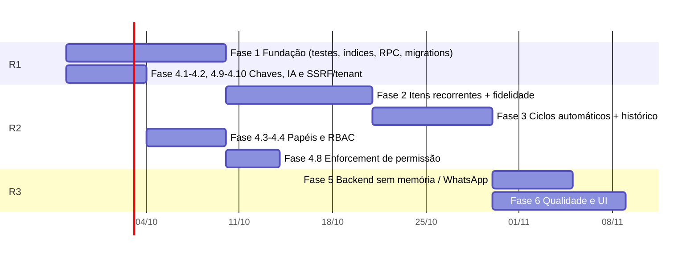

# 06 — Plano de Implementação

> Versão 2.0 · 2026-09-24 · Roteiro para fechar as lacunas do PRD (§5.6), do TRD (§9) e do Esquema de Backend (§11, verificado no banco vivo).
> Esforço em **dias de 1 desenvolvedor** (estimativa grosseira — refinar em planning). Prioridade: **P0** crítico · **P1** alto · **P2** médio · **P3** baixo.
> Numeração de fases e tarefas (`1.1`, `2.4`…) é referenciada por outros documentos — **não renumerar**; tarefas novas entram no fim de cada fase.

## 0. Ponto de partida

### 0.1 Já entregue

| Entrega | Commit |
|---|---|
| Edição de cliente + bloqueio de duplicata no cadastro manual | `94bd56b` |
| Item recorrente exibido como 1× valor do ciclo (editor de contrato) | `94bd56b` |
| Fidelidade no produto (prazo + multa %), sempre visível | `94bd56b` |
| Venda multi-produto (carrinho) numa única proposta | `94bd56b` |
| Correção da corrida que duplicava clientes ao ganhar lead | `9f27b05` |
| Recorrência separada de parcelamento (`saleCalculator`) | `a4d3849` |

### 0.2 Achados do banco vivo que entram no plano (2026-09-24)

| Achado | Onde entra |
|---|---|
| 4 migrations de 21/09 **não aplicadas** (`a1` bloqueio de período no banco; `cr1` cargos/squads só admin; `cr2` guarda de módulos/plano; `cr3` leitura por módulo clínica/educação) | Tarefa **1.6** |
| Permissões por módulo em **modo log** (`permission_check_log.would_have_blocked`) — nada bloqueia | Tarefa **4.8** |
| `clientes` sem índice único de documento/e-mail | Tarefa **1.1** |
| `chat_contacts`/`chat_messages` **já existem** (com RLS) e webhooks de saída **já são despachados** por trigger (`pg_net`) | Fase 5 reduzida (5.2/5.4 ajustadas) |
| `users.is_tenant_admin` é coluna real (RBAC "admin do tenant" existe, papel funcional é que é texto livre) | Tarefa 4.3 |

## 1. Fases

### Fase 1 — Fundação de confiabilidade (P0) · ~11–13 dias
Objetivo: parar de depender de disciplina manual para não quebrar dinheiro e dados.

| # | Tarefa | Esforço | Critério de aceite |
|---|---|---|---|
| 1.1 | **Índices únicos** em `clientes` + limpeza dos duplicados existentes | 1,5 | (a) Script lista duplicados por `(tenant_id, documento normalizado)` e `(tenant_id, lower(email))`; (b) merge repontando `leads."clientId"`, `finance_entries.contato_id`, `cliente_contatos` para o sobrevivente; (c) índices criados; (d) inserção duplicada falha no banco e o app mostra mensagem clara |
| 1.2 | **Testes unitários** de `saleCalculator` | 2 | ≥ 25 casos: recorrente × parcelado, cada `DiscountType`, sem prazo, fim de mês (31/01 + 1 mês), centavos (100/3), frequência personalizada; roda no CI |
| 1.3 | **RPC transacional `close_sale`** | 3 | Fechar venda é tudo-ou-nada; falha simulada no meio não deixa proposta sem lançamentos; modal chama 1 RPC; RLS respeitada (`SECURITY INVOKER`) |
| 1.4 | **Gerar tipos TypeScript** do banco + regenerar `schema.sql`; job de drift no CI | 1 | `types` gerado no repo; CI falha se o banco divergir do arquivo |
| 1.5 | Testes de regressão de `syncAcceptedProposal` | 2 | 3+ cenários: idempotência (2 execuções → 1 contrato), desconto proporcional, MRR = mensalidade real |
| 1.6 | **Reconciliar migrations não aplicadas** (`a1`, `cr1`, `cr2`, `cr3`) | 1,5 | Cada migration revisada, testada em **branch Supabase**, aplicada ou removida do repo; `guard_finance_period_lock` ativo no banco; advisors sem alerta novo — **Status 2026-09-24:** `a1` (bloqueio de período no banco) **aplicado**; `cr1`, `cr2` (aplicação negada pelo classificador do ambiente), `cr3` e `m5_m7` **pendentes de aplicar** — impacto medido: 0 períodos bloqueados, 0 usuários perderiam acesso a dados de clínica/educação; `a4` já estava aplicado |
| 1.7 | **Versionar o que existe só no banco:** índice `contracts_proposal_id_unique` e a publicação `supabase_realtime` (111 tabelas); publicar `finance_audit_log`, `finance_*` restantes e `chat_*` que o front escuta | 0,5 | Migration recria o estado atual de forma idempotente; realtime chega nas tabelas escutadas |

**Riscos:** RPC muda o contrato do modal → manter caminho antigo atrás de flag até validar; índices únicos exigem deduplicar antes; `a1` pode bloquear escritas legítimas em período fechado (avisar usuários).

**SQL de referência — 1.1**
```sql
-- duplicados por documento (normalizado) — rodar antes do índice
select tenant_id, regexp_replace(documento,'\D','','g') as doc, count(*), array_agg(id order by created_at)
from clientes where coalesce(documento,'') <> ''
group by 1,2 having count(*) > 1;

-- índices (após o merge); documento tem formatos mistos (com/sem máscara) → normalizar na expressão
create unique index concurrently clientes_tenant_doc_uq
  on clientes (tenant_id, regexp_replace(documento,'\D','','g'))
  where coalesce(documento,'') <> '';
create unique index concurrently clientes_tenant_email_uq
  on clientes (tenant_id, lower(email))
  where coalesce(email,'') <> '';
```

**Esboço — 1.3**
```sql
create or replace function close_sale(p_lead_id uuid, p_items jsonb, p_payment jsonb)
returns jsonb language plpgsql security invoker as $$
-- 1) cria proposals (+ proposal_items) 2) gera finance_entries por item (ciclos/parcelas)
-- 3) atualiza leads (status, productIds, value = soma das propostas) — tudo na mesma transação
-- retorna { proposal_id, entries: n }
$$;
```
O cálculo do cronograma continua em `saleCalculator` (cliente) e é enviado pronto em `p_items`; a RPC valida totais (soma do cronograma = total do item) antes de gravar.

### Fase 2 — Modelo de itens recorrentes e fidelidade (P1) · ~9–11 dias
Objetivo: eliminar a convenção `quantidade = ciclos × unidades` (D1) e dar efeito real à fidelidade (D5).
**Dependência:** 1.2 e 1.5 concluídas.

| # | Tarefa | Esforço | Critério de aceite |
|---|---|---|---|
| 2.1 | Migração `proposal_items.cycles int not null default 1` + backfill; `quantidade` passa a ser a real | 2 | Backfill idempotente e **reversível**; amostra de 20 propostas reais conferida manualmente |
| 2.2 | Ajustar `AddProdutoLeadModal`, `syncAcceptedProposal` (MRR = `preco × quantidade`; total do período = `× cycles`), `PropostasTable`, editor, PDF, proposta pública, `get_public_proposal` | 3 | MRR e totais idênticos aos de antes em amostra real (comparação automatizada) |
| 2.3 | Remover a compensação de exibição (`billing_type` no editor) | 0,5 | Tabela do editor mostra `quantidade` real |
| 2.4 | **Fidelidade → contrato:** copiar `loyaltyMonths`/multa para `contracts` (`loyalty_until`, `early_termination_fee_percent`); cláusula automática no editor e na proposta ("Fidelidade de 12 meses, multa de X%") | 2,5 | Proposta com item fidelizado exibe a cláusula; contrato guarda os campos |
| 2.5 | **Cancelamento antes do fim da fidelidade:** multa = % × mensalidades restantes → lançamento a receber, com prévia e confirmação | 2 | Fluxo "Cancelar contrato" (`contracts.cancelled_at`) mostra o valor antes de confirmar; lançamento criado com `proposal_id` |

**Backfill 2.1 (esboço)**
```sql
alter table proposal_items add column cycles int not null default 1;
-- recorrente com prazo: cycles = contract_months / meses_do_ciclo(frequency); quantidade = quantidade / cycles
-- recorrente sem prazo (contract_months is null): cycles = quantidade / unidades (lote inicial de 12)
```

### Fase 3 — Continuidade de cobrança e histórico (P1) · ~7–9 dias

| # | Tarefa | Esforço | Critério de aceite |
|---|---|---|---|
| 3.1 | **Geração automática de ciclos** para recorrência "sem prazo" (`pg_cron` já instalado **ou** Vercel Cron) | 3 | Próximo ciclo nasce sozinho; idempotente por `(recurring_group_id, ciclo)`; log de execução |
| 3.2 | Aba Produtos do lead lista **todas** as propostas (histórico) com totais | 2 | Nenhuma proposta "some" da UI |
| 3.3 | Editar proposta existente: adicionar/remover item e recalcular (hoje itens são só leitura no editor) | 3 | Alterar itens atualiza proposta, lançamentos pendentes e `leads.value`; lançamentos **pagos** não são alterados |
| 3.4 | Status **Expirada** automático por `validade` | 0,5 | Job diário muda `Enviada`/`Aberta` vencidas |

### Fase 4 — Segurança e RBAC (P0/P1) · ~15–19 dias
Fonte: `SECURITY_AUDIT.md` e achados do banco vivo.

| # | Tarefa | Prio | Esforço | Critério de aceite |
|---|---|---|---|---|
| 4.1 | 🚨 Rotacionar chaves vazadas no histórico do Git (Gemini, `SPY_API_KEYS`) e credencial master antiga | P0 | 0,5 (manual) | Chaves antigas invalidadas; novas só em variáveis de ambiente |
| 4.2 | Mover chamadas de IA do cliente para `/api/ai/*`; remover `VITE_GEMINI/GROQ_API_KEY` | P0 | 3 | `grep VITE_GEMINI` vazio; bundle sem chave |
| 4.3 | **Papéis:** tabela de papéis/permissões; `users.role` deixa de ser texto livre (`is_tenant_admin` já existe) | P1 | 4 | Papéis definidos e migrados; UI de permissões grava no modelo novo |
| 4.4 | RBAC nas rotas `requireUser` sensíveis (auditorias de IA do tenant inteiro) | P1 | 1 | Vendedor comum recebe 403 em `/api/ai/performance-audit` |
| 4.5 | CSP (após inventariar recursos externos) | P2 | 2 | Header `Content-Security-Policy` em modo report-only → enforce |
| 4.6 | Remover gate por `tenantName.includes("G-Tech")` no `Sidebar` | P2 | 0,5 | Visibilidade por papel/módulo |
| 4.7 | Verificar assinatura em qualquer webhook de **entrada** novo (padrão em `WEBHOOKS.md`) | P2 | sob demanda | HMAC validado; tenant resolvido por instância cadastrada |
| 4.8 | **Enforcement de permissão por módulo** (sair do modo log): analisar `permission_check_log.would_have_blocked`, corrigir falsos positivos, ligar bloqueio | P1 | 3 | 30 dias de log sem falso positivo crítico; bloqueio ativo em CRM/Financeiro/RH/Clínica/Educação |
| 4.9 | 🚨 **`resolveTenantId` do Google Calendar** (`server/googleCalendar.ts` ~165–171) devolve o tenant pedido em `x-active-tenant-id` **mesmo quando `has_tenant_access` nega** → responder 403 | P0 | 0,5 | Header com tenant alheio recebe 403; teste automatizado — ✅ corrigido em `server/googleCalendar.ts` (403 quando `has_tenant_access` nega) |
| 4.10 | 🚨 **SSRF autenticado** em `/api/integrations/webhook-test` e `/smtp-test`: bloquear loopback/IPs privados/metadata (`169.254.169.254`), validar DNS resolvido, limitar redirects | P0 | 1,5 | Destinos internos rejeitados; teste com IPs privados — ✅ `server/ssrfGuard.ts` + uso em `webhook-test`/`smtp-test` (resta DNS rebinding: IP validado não é fixado na conexão) |
| 4.11 | `POST /api/public-proposal/:token/accept`: conferir status atual (só `Enviada`/`Aberta`), `validade`, `view_count` atômico, rate limit, gravar quem aceitou | P1 | 1,5 | Proposta recusada/expirada não pode ser aceita; limite por IP/token — ✅ status/validade/rate limit; **pendente:** gravar quem aceitou e `view_count` atômico (exigem coluna/RPC) |
| 4.12 | Cache Redis por tenant **e permissão**: incluir usuário/cargo na chave (ou não cachear) nas rotas de módulos com controle por cargo (`/api/clinica/*`, `/api/education/*`, `table-preview`) | P1 | 1 | Usuário sem permissão não recebe resposta cacheada de outro — ✅ cache por usuário em `clinica/*`, `education/mensalidades`, `table-preview` de `students`/`turmas`; demais rotas seguem por tenant |
| 4.13 | `/api/auth/tenant-theme`: não revelar se um e-mail existe nem permitir enumerar tenants por nome; rate limit | P2 | 1 | Resposta uniforme; limitador ativo — ✅ busca por e-mail removida (resposta uniforme) + rate limit 20/min — conferir se o login dependia do tema por e-mail |
| 4.14 | `GET /api/admin/permission-check-log` exigir `requireMaster` (hoje só `requireUser`) e conferir que `POST /api/admin/tenant` define `is_tenant_admin=true` no admin inicial | P2 | 0,75 | 403 para não-master; admin do tenant novo enxerga telas de admin — ✅ `requireMaster` em `permission-check-log`; `is_tenant_admin: true` no admin inicial |

### Fase 5 — Backend sem estado em memória (P2) · ~4–6 dias
*(reduzida: `chat_contacts`/`chat_messages` e despacho de webhooks já existem no banco)*

| # | Tarefa | Esforço | Critério de aceite |
|---|---|---|---|
| 5.1 | Tabela `tenant_settings` (categoria + itens jsonb) com RLS; migrar `sources`, `custom-fields`, `task-categories`, `templates` | 2 | Configuração sobrevive a cold start/redeploy |
| 5.2 | **Simulador de WhatsApp:** garantir que o caminho simulado também persiste em `chat_*` (o caminho WAHA real já persiste — migration `20260921_whatsapp_real_chat_persistence`) e publicar `chat_*` no realtime | 1 | Mensagens persistem entre deploys nos dois caminhos |
| 5.3 | **Endurecer o WAHA real:** segredo do webhook em header (hoje `?secret=` na URL, comparação não constante), associar mensagem ao lead, decisão de provedor | 3+ | Webhook assinado; mensagem recebida cria `chat_messages`/`messages` e associa ao lead |
| 5.4 | **Webhooks de saída: entregas e retentativas** (a tela de configuração e o despacho por trigger já existem) — painel de `webhook_logs`, retentativa com backoff, teste de assinatura | 2 | Admin vê status de entrega e reenvia falhas |

### Fase 6 — Qualidade de código e UI (P2/P3) · contínuo (~17 dias)

| # | Tarefa | Esforço | Critério de aceite |
|---|---|---|---|
| 6.1 | Concluir refactor por blocos (`TODO.md` Etapas 3–4) | 6 | Nenhum arquivo de página/modal > ~500 linhas |
| 6.2 | Tokens de tema nos modais com cores fixas (`NovoClienteModal`, abas de Produto) | 2 | Tema claro e escuro corretos |
| 6.3 | Acessibilidade: `aria-label` em botões só-ícone; cards clicáveis → `button`/`role="switch"` | 1,5 | Navegação por teclado nos toggles |
| 6.4 | Unificar `NovoClienteModal` duplicado | 0,5 | 1 componente |
| 6.5 | Consolidar funis (`crm_funis` × `pipelines/stages`) e a convenção snake/camel em `leads`/`products` | 3 | 1 fonte de verdade por conceito; view de compatibilidade se necessário |
| 6.6 | **Bugs de UI documentados no doc 04:** `SDRWebhookModal` nunca renderizado no `Layout`; atalhos do `MobileNav` nunca ficam ativos; FAB financeiro sempre em "Pagar"; `SettingsGenericForm` com "Salvar" que não salva; rotas de módulo desabilitado acessíveis por URL | 2 | Cada item com teste manual/E2E; módulo desabilitado redireciona — ✅ SDRWebhookModal montado no Layout; MobileNav com rotas reais; FAB Receber/Pagar; `SettingsGenericForm` honesto (desabilitado); `requireModule` também confere `tenants.modules`; `scrollbar-thin`; `aria-label`/`role=switch` |
| 6.7 | **Bugs de fluxo documentados no doc 03/TRD:** id do aluno na matrícula (`gerar_mensalidades_matricula`), `Eventos.tsx` lendo colunas antigas, MRR de assinatura sem prazo superestimado, `deleteLead`/`deleteStudent` sem checar erro nem reverter estado otimista, `finalizar_venda` gravando `Receita`/`Recebido` (conferir vs. `Receber`/`Pago` do app) | 3 | Cada item reproduzido, corrigido e coberto por teste — **Parcial:** ✅ `deleteLead`/estado otimista com rollback, MRR sem prazo, normalização `Receita/Despesa/Recebido → Receber/Pagar/Pago` na leitura; verificado sem bug: id do aluno e `Eventos.tsx`. **Pendente:** migration que corrija a RPC `finalizar_venda` (grava `Receita`/`Recebido`) para que filtros no banco e o bloqueio de período (`Pago`) funcionem |
| 6.9 | ✅ **Código concluído (2026-09-24):** removidos `mia-6`/`apple` e o *fallback* `apple` (agora `spy`), links da landing (Varejo/Automotivo no lugar de Apple; "Implantar" → `/f/spy`), preset `apple_tech` (substituído por Varejo e Automotivo) e nicho "Concessionária" → "Automotivo" em `NovoTenantModal`. **Pendente:** aplicar a migration `20260924_remove_mia_funnel_add_automotivo_niche.sql` (remove o funil MIA-6 sem leads e cadastra o nicho global Automotivo) | 1,5 | `grep -ri "apple\|mia-6\|MIA" src` vazio; `/f/varejo` e `/f/automotivo` funcionam; Automotivo selecionável em Configurações → Nichos após aplicar a migration |
| 6.8 | Code-splitting: hoje há **1** `React.lazy` e bundle principal ~4,96 MB sem compressão (medição a refazer) → `lazy` por módulo e `manualChunks` | 1,5 | Bundle inicial reduzido ≥ 40% (medido) |

## 2. Releases

| Release | Conteúdo | Saída esperada |
|---|---|---|
| **R1 — Confiança** | Fase 1 + 4.1/4.2 | Dados protegidos contra duplicidade e falha parcial; chaves seguras |
| **R2 — Recorrência de verdade** | Fase 2 + Fase 3 + 4.3/4.4/4.8 | Fidelidade com efeito financeiro; ciclos automáticos; papéis reais |
| **R3 — Escala e polimento** | Fase 4.5–4.7 + Fase 5 + Fase 6 | Sem estado em memória; WhatsApp real; código e UI consistentes |

## 3. Ordem e dependências



Datas ilustrativas — ajustar à capacidade real. **Caminho crítico:** 1.2/1.5 → 2.1/2.2 → 2.4/2.5 → 3.1.

## 4. Estratégia de entrega e rollback

- **Uma migração por PR**, sempre com `tenant_id` + RLS e `get_advisors` executado depois.
- **Branch Supabase** para toda migration de risco (1.1, 1.6, 2.1): testar, comparar, só então aplicar em produção.
- **Feature flags** por tenant (`tenants.modules`) para liberar `close_sale` e o novo modelo de itens primeiro em um tenant piloto.
- **Backfill reversível**: script de ida e de volta + backup lógico da tabela antes de qualquer `ALTER` em `proposal_items`/`finance_entries`.
- **Rollback:** cada release tem (a) flag para voltar ao caminho antigo, (b) migration `down` documentada, (c) critério de "abortar" (ex.: divergência de MRR > 0,5% na comparação automática).
- **Commits pequenos por lote** (regra do `TODO.md`); CI (`tsc`, `audit`, `build`) verde para merge.
- **Sem customização por tenant:** toda entrega é genérica.

## 5. Plano de testes

| Nível | Escopo | Ferramenta | Quando |
|---|---|---|---|
| Unitário | `saleCalculator` (1.2), funções puras de MRR/desconto | runner TS (ex.: Vitest) | R1 |
| Integração | `syncAcceptedProposal`, `createClientFromWonLead` (corrida), `close_sale` | Vitest + banco de teste/branch | R1–R2 |
| Banco | RLS por tenant (usuário A não lê tenant B), unicidade de clientes, trigger de período | `supabase/tests` (SQL) | R1 |
| E2E | Lead → venda multi-produto → proposta → aceite → financeiro; edição de cliente; produto com fidelidade | Playwright (já é dependência) | R2 |
| Comparação de dados | MRR/total por proposta antes × depois de 2.x | script SQL/TS | R2 |
| Segurança | varredura de segredos no bundle; 403 de RBAC; headers | CI + checklist | R1–R3 |

## 6. Observabilidade e métricas de sucesso do plano

| Métrica | Meta | Fonte |
|---|---|---|
| Clientes duplicados criados | 0 | índice único + consulta periódica |
| Divergência `leads.value` × soma das propostas | 0 | consulta de auditoria |
| Divergência MRR dashboard × soma de mensalidades de contratos ativos | < 0,5% | script de comparação |
| Vendas com estado parcial (proposta sem lançamentos) | 0 após `close_sale` | consulta de auditoria |
| Falsos positivos de permissão antes do enforcement | ~0 em 30 dias | `permission_check_log` |
| Chaves de IA no bundle | 0 | grep no CI |

## 7. Definição de pronto (DoD) por tarefa

1. `npm run lint` e `npm run build` limpos.
2. Regra financeira alterada → teste automatizado cobrindo o caso.
3. Tabela/coluna nova → RLS + índice + advisors sem alerta novo.
4. UI nova → tema claro e escuro, mobile, estados vazio/erro/carregando.
5. Migration com script de rollback e testada em branch.
6. Documentação atualizada (`docs/projeto/*` e `docs/*` afetados).

## 8. Riscos do plano

| Risco | Prob. | Impacto | Resposta |
|---|---|---|---|
| Migração de `quantidade` altera MRR histórico | Média | Alto | Backfill em sombra, comparação antes/depois, feature flag |
| `close_sale` diverge do fluxo atual | Média | Alto | Testes de paridade; caminho antigo atrás de flag |
| Duplicados existentes bloqueiam o índice único | Alta | Médio | Script de deduplicação com merge de vínculos (`clientId`, `contato_id`) |
| Ligar `guard_finance_period_lock` (1.6) bloqueia lançamentos legítimos | Média | Médio | Comunicar; período fechado é decisão do admin; testar em branch |
| Enforcement de permissão (4.8) bloqueia fluxo legítimo | Média | Alto | Só ligar após 30 dias de log limpo; flag por módulo |
| Provedor de WhatsApp real indefinido | Alta | Médio | Decisão de produto antes da 5.3 |
| Trabalho paralelo no mesmo arquivo (já ocorreu em `ClientesList.tsx`) | Média | Baixo | Commits frequentes; `git pull` antes de cada lote |
| Único ambiente Supabase (produção) | Alta | Alto | Usar branches do Supabase para toda migration de risco |

## 9. Decisões pendentes (dono: produto)

1. Modelo de permissão dentro do tenant (papéis fixos × configuráveis).
2. Fidelidade: multa sobre **mensalidades restantes** (atual) ou valor fixo/pro-rata?
3. Provedor de WhatsApp e política de mensagens.
4. Emissão fiscal (NFS-e) entra no roadmap?
5. Proposta editável após "Enviada": versionar ou sobrescrever?
6. Período fechado (`a1`): bloquear no banco para todos, ou permitir override de admin?
7. Consolidação de funis: qual modelo sobrevive (`crm_funis` ou `pipelines/stages`)?
